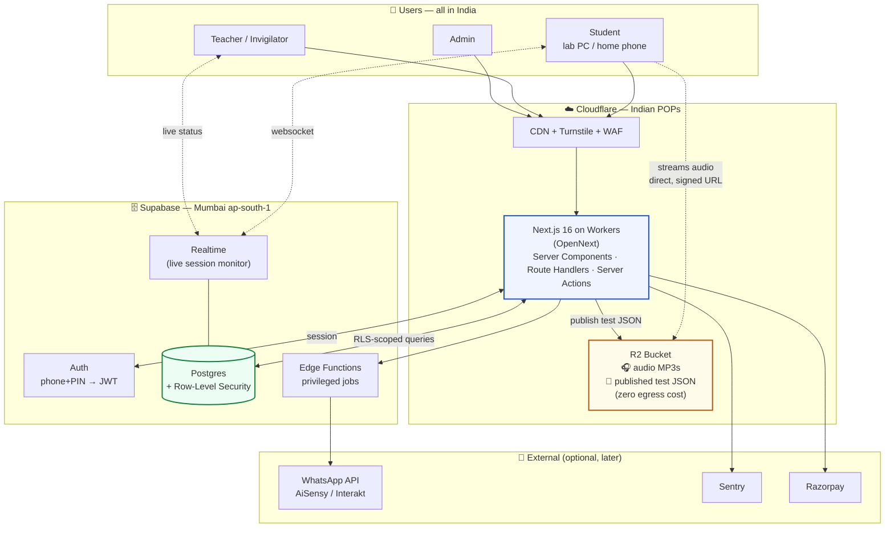
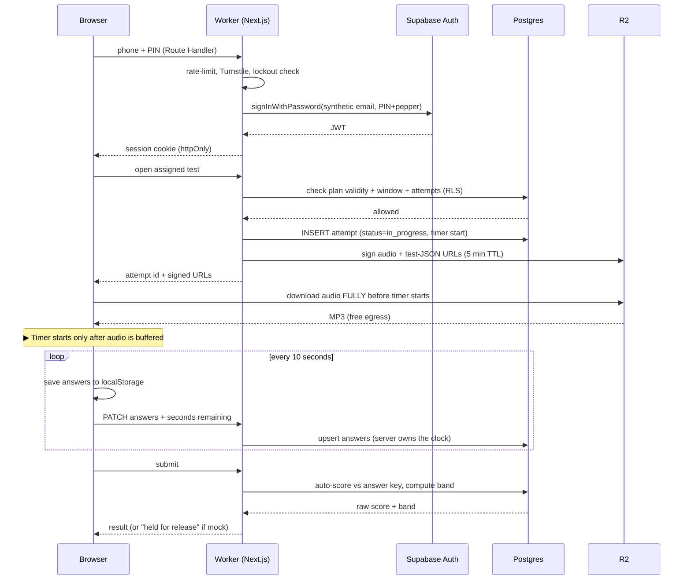
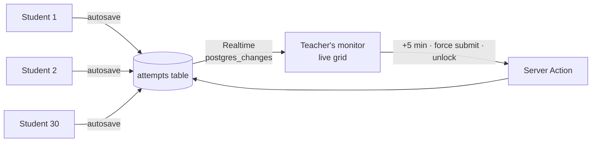

# IELTS Platform — Tech Stack & Architecture

**Constraints:** Next.js + React (non-negotiable) · India-only users · keep it cheap · small team.
**Prices verified 6 Sep 2026.** USD converted at ₹90.

---

## 1. The verdict

| Layer | Choice | Why | Cost |
|---|---|---|---|
| **Framework** | **Next.js 16 (App Router) + React 19 + TypeScript** | Your requirement. App Router gives you Server Components for the heavy admin tables and client components for the test player | ₹0 |
| **Styling** | **Tailwind CSS v4 + shadcn/ui** | shadcn is copy-paste components you own, not a dependency. Maps 1:1 onto the design tokens in `DESIGN-PROMPT.md` | ₹0 |
| **Database** | **Supabase Postgres — `ap-south-1` (Mumbai)** | Confirmed available. India users hit an India database: ~20–40 ms instead of ~180 ms via Singapore | ₹0 → ₹2,250/mo |
| **Auth** | **Supabase Auth**, phone+PIN via synthetic-email pattern (§3) | Gives you sessions + JWT that Row-Level Security understands, for free | included |
| **Authorization** | **Postgres Row-Level Security** | "A student can read only their own attempts" enforced in the DB, not in your React code | included |
| **Audio + test JSON** | **Cloudflare R2** | **Zero egress charges.** 10 GB storage free. This is the single biggest cost decision | ₹0 |
| **Hosting** | **Cloudflare Workers via OpenNext** (see §4) | ~₹450/mo, runs in Mumbai/Delhi/Chennai/Bangalore POPs | ₹450/mo |
| **Realtime** | **Supabase Realtime** | Powers the live session monitor. No extra service | included |
| **Media/CDN** | Cloudflare CDN (free plan) | Indian POPs, free | ₹0 |
| **Errors** | Sentry free tier | 5k events/mo free | ₹0 |
| **Email** | Resend | Only for admin/teacher, students use PIN | ₹0–900/mo |
| **Repo/CI** | GitHub + GitHub Actions | Free for private repos | ₹0 |

**Total to launch: ~₹500/month.** At 500 students: ~₹2,800/month.

### Supporting libraries

```
Data fetching   @supabase/ssr (server) + TanStack Query (client)
Server queries  Drizzle ORM (typed SQL for admin/analytics)
Forms           react-hook-form + zod
Tables          TanStack Table (admin lists, 28 screens' worth)
Charts          Recharts (band trend, accuracy bars)
Dates           date-fns + date-fns-tz (Asia/Kolkata everywhere)
CSV import      papaparse
Audio           native <audio> + custom controls (no library needed)
Bot protection  Cloudflare Turnstile on the login form
```

---

## 2. Why these, specifically for India

**Region is the whole game.** Your users are all in India, so every hop to Singapore or Virginia is wasted latency on a timed test. Supabase's Mumbai region (`ap-south-1`) plus Cloudflare's Indian edge means the entire request path stays in-country. Pick the region at project creation — **you cannot change it later without a full migration.**

**Bandwidth is your real cost, and it's all audio.** A Listening test is a ~9 MB MP3. Thirty students in a lab = 270 MB per session. Daily use across batches easily crosses 50 GB/month. On most platforms that's a bill; on R2 egress is free, permanently. Everything else you serve is text.

**DPDP Act 2023 applies to you.** India's data protection law treats anyone under 18 as a child, requiring verifiable parental consent before processing their data — and IELTS candidates are routinely 16–17. Practically: capture date of birth at enrolment, record a guardian consent flag for under-18s, keep data in India (Mumbai region already does this), and have a stated retention period. This is a form field and a checkbox now, versus a legal problem later.

**Don't build on SMS.** Sending transactional SMS in India requires DLT registration with a telecom operator — header and template approval, a multi-week process. You already chose phone+PIN, which sidesteps it entirely. If you later want reminders, use **WhatsApp Business API** (AiSensy or Interakt, ~₹1,000–2,500/mo) instead — higher open rates and no DLT queue.

**If you ever charge online:** Razorpay. It handles UPI, which is how Indian students actually pay.

---

## 3. Phone + PIN on Supabase Auth

Supabase Auth doesn't natively do "phone + PIN", but you don't need custom auth. Use the **synthetic email** pattern:

```
Student's login:   9876543210  +  PIN 4821
Stored internally: 919876543210@students.yourdomain.in  /  password = PIN + server pepper
```

The student never sees the email. You get real Supabase sessions, real JWTs, and RLS works out of the box.

**A 4-digit PIN is 10,000 combinations — treat it as weak by default.** Mandatory mitigations:

1. Login goes through a **Next.js Route Handler**, never directly from the browser to Supabase. The pepper stays server-side.
2. `failed_attempts` + `locked_until` columns; lock for 15 minutes after 5 wrong PINs.
3. Rate-limit by IP *and* by phone number (Upstash Redis free tier, or a Postgres table).
4. Cloudflare Turnstile on the login form.
5. 6-digit PIN if you can persuade them — 100× the search space for one extra keypress.
6. One active session per student (kills PIN-sharing and doubles as anti-cheat).

Admins and teachers get **email + real password + optional 2FA** — different threat model, they can delete data.

---

## 4. Hosting: the one real decision

Vercel Hobby is out — its terms restrict it to non-commercial personal use, and a paid coaching institute is commercial. So you're choosing between three paid paths:

| | **Cloudflare Workers + OpenNext** | **Vercel Pro** | **VPS (Hostinger/DO Bangalore)** |
|---|---|---|---|
| Cost | **$5/mo ≈ ₹450** | $20/mo/seat ≈ ₹1,800 + usage | ₹700–1,200/mo |
| India presence | Many POPs (Mumbai, Delhi, Chennai, Bengaluru, Hyderabad) | Mumbai `bom1` region on Pro | One Indian datacentre |
| Next.js support | Next 14/15/16, Node runtime, ISR, PPR, App Router ✓ | Native, everything works | Native (`next start` in Docker) |
| Known gaps | Node middleware unsupported; 10 MB compressed worker limit | none | none |
| Ops burden | Low | Lowest | **You patch, backup, monitor, restart** |
| Bandwidth cost | Free | 1 TB then metered | Usually generous |
| Setup friction | Medium (one adapter) | None | High |

### Recommendation

**Cloudflare Workers + OpenNext.** It's ₹1,350/month cheaper than Vercel, keeps you in the same ecosystem as R2 (so audio and app share one dashboard and one bill), and the adapter now supports Next.js 16 with the full Node runtime including ISR and Turbopack. Deploy with:

```bash
npm create cloudflare@latest -- ielts-app --framework=next --platform=workers
```

**But write the app so hosting is a swap, not a rewrite.** Avoid `@vercel/*` packages, Vercel-only KV/Blob, and Node-runtime middleware. Keep business logic in Route Handlers and Server Actions. Then if OpenNext ever fights you, `git push` to Vercel Pro is a one-day migration — and vice versa.

**Skip the VPS** unless you enjoy sysadmin work. It's ₹300/month cheaper than Workers and costs you a weekend every time Postgres needs patching or the box runs out of disk mid-session.

---

## 5. Architecture



### Why audio bypasses the app server

The student's browser fetches the MP3 **straight from R2** using a short-lived signed URL that the Worker issues. The audio never passes through your app server, so 30 simultaneous downloads cost you nothing in compute and nothing in bandwidth. Same for published test JSON — the Worker writes a static snapshot to R2 when a teacher publishes a test, and 30 browsers read that cached file instead of hammering Postgres.

Postgres stays the source of truth for authoring, answer keys, assignments and analytics. R2 holds the read-only published copy the player consumes. This split is what keeps you on Supabase's free tier far longer than you'd expect.

---

## 6. Critical flows

### Student takes a mock test



**Two details that matter more than they look:**

- **The server owns the timer.** The browser displays it; Postgres decides when time is up. Otherwise a student edits the clock in devtools.
- **Audio downloads completely before the timer starts.** This is the difference between a smooth lab session and thirty students raising their hands at once. Show a "Getting your audio ready…" progress bar on the pre-test screen.

### Crash recovery

Answers live in three places: React state → `localStorage` (instant) → Postgres (every 10 s). On reload, the Worker returns the attempt with its stored `time_remaining_seconds`, and the student resumes exactly where they were. Power cuts in Indian computer labs are a *when*, not an *if* — build this in Phase 1, not Phase 6.

### Teacher's live session monitor



No polling. Supabase Realtime pushes row changes to the teacher's screen over one websocket.

---

## 7. Repo structure

```
ielts-platform/
├─ app/
│  ├─ (auth)/login/                  phone + PIN
│  ├─ (student)/
│  │   ├─ home/  tests/  progress/  profile/
│  │   └─ attempt/[id]/              ← the test player (client-heavy)
│  ├─ (teacher)/
│  │   ├─ batches/  assign/  live/[id]/  results/[id]/  analytics/
│  ├─ (admin)/
│  │   ├─ overview/  students/  plans/  batches/  library/
│  │   ├─ answer-keys/[testId]/  users/  audit/
│  └─ api/
│      ├─ auth/login/                pepper + rate limit live here
│      ├─ attempts/[id]/autosave/
│      ├─ attempts/[id]/submit/      scoring, server-side only
│      └─ media/sign/                issues R2 signed URLs
├─ components/ui/                    shadcn — the design system
├─ components/player/                audio, navigator, question types
├─ lib/
│  ├─ supabase/{server,client,admin}.ts
│  ├─ scoring.ts                     band tables + variant matching
│  ├─ rbac.ts                        permission checks
│  └─ r2.ts
├─ db/schema.ts                      Drizzle
├─ supabase/migrations/
└─ scripts/import-legacy-tests.ts    migrate your existing tests/*.js
```

**Keep scoring server-side, always.** If `scoring.ts` runs in the browser, the answer key ships to the browser.

---

## 8. Cost by stage

| Stage | Supabase | Hosting | R2 | Domain | **Total/mo** |
|---|---|---|---|---|---|
| Build + pilot (1 batch) | Free | ₹450 | ₹0 | ₹75 | **~₹525** |
| Live, ≤100 students | Free–Pro | ₹450 | ₹0 | ₹75 | **₹525–2,800** |
| 100–500 students | ₹2,250 | ₹450 | ₹0 | ₹75 | **~₹2,800** |
| 500–2,000 students | ₹2,250 + usage | ₹450–900 | ₹0–200 | ₹75 | **₹3,000–4,500** |

Move to Supabase Pro when you cross ~400 MB of database or 5 GB egress — not before. Set a usage alert at 70%; a free project that hits its ceiling mid-session is an outage.

Add WhatsApp (₹1,000–2,500/mo) only in Phase 4, and only if reminders are actually a problem.

---

## 9. India-specific gotchas

| Issue | What to do |
|---|---|
| Lab internet chokes on 30 × 9 MB audio | Pre-download before timer; if it still stutters, put a ₹12,000 mini-PC on the lab LAN caching audio locally |
| Power cut mid-test | 10-second autosave + server-held clock (§6) |
| Timezone bugs | Store UTC in Postgres, render `Asia/Kolkata` everywhere. Never `new Date()` on the client for scheduling |
| Students under 18 | DPDP: DOB field + guardian consent flag + stated retention period |
| SMS needs DLT registration | Avoid SMS. PIN login + WhatsApp later |
| Region locked at creation | Choose `ap-south-1` when you create the Supabase project. Cannot be changed |
| Cheap Android phones at home | Test on a 4-year-old mid-range Android, not your laptop. Budget the JS bundle: the player should stay under ~200 KB gzipped |

---

## 10. Build order

1. **Create the Supabase project in `ap-south-1`.** Everything else depends on it and it can't be changed later.
2. `npm create cloudflare@latest -- ielts-app --framework=next --platform=workers`, wire Tailwind + shadcn to the tokens in `DESIGN-PROMPT.md`.
3. Apply the schema from `PLAN-V2.md` §4, plus RLS policies. Write the policies *with* the tables — retrofitting RLS onto a live app is miserable.
4. Login (phone+PIN with lockout) → student home → test player with autosave. Prove crash recovery works by killing the browser mid-test.
5. Port `tests/reading-er-01.js` and `tests/listening-t1.js` into the DB with `scripts/import-legacy-tests.ts`. **Their answer keys are still empty — that blocks scoring, so fill them first.**
6. Run one real batch of 5 students before building any admin screen you haven't already needed.

---

## 11. Things that will cost you later if you do them now

- Putting the Supabase project in Singapore or Virginia "for now".
- Skipping RLS and filtering by `user_id` in React instead.
- Scoring answers in the browser.
- Trusting a client-side timer.
- Serving audio through your app server.
- Storing test content only as denormalised JSON — you'll want to query "which questions does this batch fail most?" and you'll be sorry.
- Using `@vercel/*` packages, which quietly weld you to one host.
