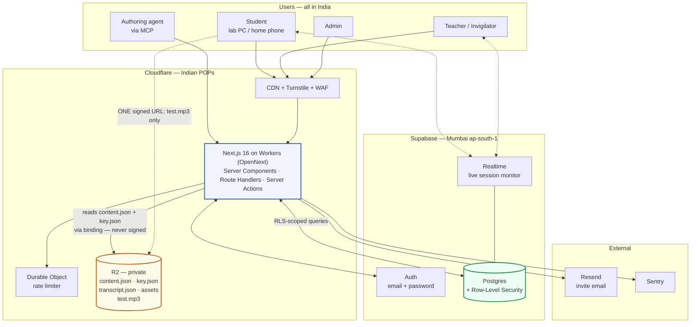
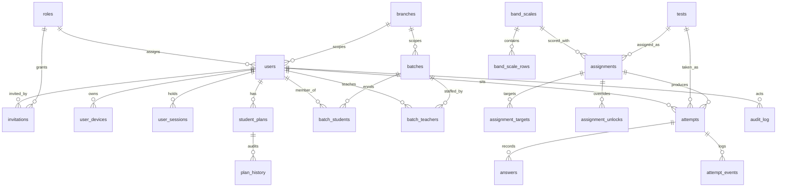
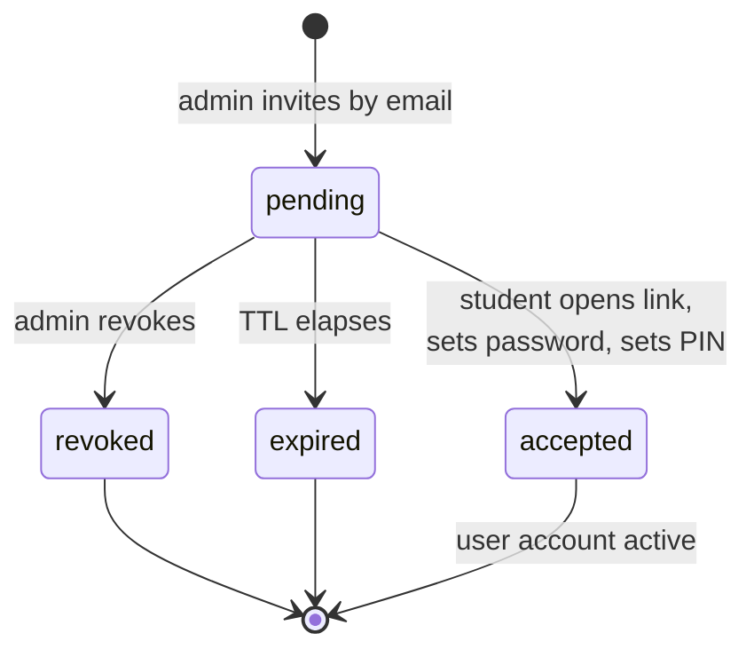

# Insignia IELTS — MVP 1 Specification

> **This file is the contract.** It says what to build, how it must behave, and what it must never do.
> For *where the project currently stands*, read [`PROJECT-MEMORY.md`](PROJECT-MEMORY.md) — that is where progress is tracked.
>
> **Status:** Specification complete · Build not started · Active milestone: **M0**
> **Last updated:** 2026-09-14

---

## Table of contents

1. [How to use this file](#1-how-to-use-this-file)
2. [Source documents](#2-source-documents)
3. [Decision log](#3-decision-log)
4. [Stack](#4-stack)
5. [Architecture](#5-architecture)
6. [Database — ERD and table design](#6-database--erd-and-table-design)
7. [Server authority](#7-server-authority-d6)
8. [Security — threat model and controls](#8-security--threat-model-and-controls-d7)
9. [Accounts, invites and login](#9-accounts-invites-and-login-d9)
10. [Question types](#10-question-types-d12)
11. [Test upload JSON, importer and MCP](#11-test-upload-json-importer-and-mcp-d11)
12. [Audio caching](#12-audio-caching-d8--d10)
13. [Row-Level Security](#13-row-level-security)
14. [R2 layout and signing rules](#14-r2-layout-and-signing-rules)
15. [Repo structure and design system](#15-repo-structure-and-design-system)
16. [Documentation and code organisation](#16-documentation-and-code-organisation-d13)
17. [Screen inventory](#17-screen-inventory)
18. [Milestones and tasks](#18-milestones-and-tasks)
19. [Verification](#19-verification)
20. [Risks](#20-risks)

---

## 1. How to use this file

**The product.** An IELTS Listening + Reading practice-test platform for a coaching institute in India. Students take timed mock and practice tests in a computer lab or at home; teachers assign tests and release results; admins manage accounts, batches and plan validity.

**The one design rule that overrides everything** (from `DESIGN-PROMPT.md`): *a 10-year-old must be able to use the student side without being told how.* One obvious action per screen, words over icons, plain language, nothing below 16px, no nesting deeper than two taps from home. Teacher and admin sides may be dense — they are power users — but use the same visual language.

### For agents picking this up cold

1. Read this file for the contract.
2. Read [`PROJECT-MEMORY.md`](PROJECT-MEMORY.md) for where we actually are.
3. Pick the next `todo` task from the status board in that file.
4. Build it. Update the memory file **in the same commit**.

### Conventions

| Thing | Rule |
|---|---|
| Task ID | `M<milestone>-<nn>`, e.g. `M2-07`. Defined in [§18](#18-milestones-and-tasks), ticked in `PROJECT-MEMORY.md`. |
| This file | Stable. Edit it only when the *contract* changes, and record why in the memory file's decision log. |
| Progress | Never tracked here. Only in `PROJECT-MEMORY.md`. |
| New decisions | Log in `PROJECT-MEMORY.md` §4; promote to `docs/adr/` if architectural. |
| Commits | Conventional commits. Reference the task ID: `feat(player): server-authoritative timer (M2-08)`. |

### Definition of done

A task is done when **all** of these hold:

- [ ] It works, and you have run it — not just typechecked it.
- [ ] Typecheck, lint and tests pass.
- [ ] Any rule from [§7](#7-server-authority-d6) it touches has a test.
- [ ] Any threat from [§8](#8-security--threat-model-and-controls-d7) it touches is addressed, not deferred.
- [ ] Exported functions have TSDoc; new modules have a `README.md`.
- [ ] `PROJECT-MEMORY.md` is updated in the same commit.

---

## 2. Source documents

| Document | Authoritative for | Status |
|---|---|---|
| [`Design files/DESIGN-PROMPT.md`](Design%20files/DESIGN-PROMPT.md) | Design system, all 30 screens, UX rules | **Current** |
| [`Design files/TECH-STACK.md`](Design%20files/TECH-STACK.md) | Stack, India-specific constraints, costing | Current **except §3 (auth)** — superseded by [D9](#3-decision-log) |
| [`Design files/PLAN-V2.md`](Design%20files/PLAN-V2.md) | Requirements by role, build phases | Current **except §4 (`questions` table)** — see [D4](#3-decision-log) |
| [`Design files/PLAN.md`](Design%20files/PLAN.md) | Costing, IELTS marking rules | Superseded by PLAN-V2 except §4 and §7 |
| [`Design files/Prioritizing project scope/`](Design%20files/Prioritizing%20project%20scope/) | 12 rendered student screens + design system | **Current** — the visual reference |
| [ielts.org format pages](https://ielts.org/take-a-test/test-types/ielts-academic-test/ielts-academic-format-listening) | Official question types and test structure | Fetched 2026-09-14 → [§10](#10-question-types-d12) |

**Where this file and a source doc disagree, this file wins.**

---

## 3. Decision log

| # | Decision | Rationale |
|---|---|---|
| **D1** | **Next.js 16 App Router + React 19 + TypeScript**, deployed via `@opennextjs/cloudflare` to Workers | `TECH-STACK.md` §4. The repo's existing `vinext` scaffold is boilerplate only; re-scaffold. Avoid `@vercel/*` packages so hosting stays a swap, not a rewrite. |
| **D2** | Scope = **full product**: student + teacher + admin | PLAN-V2 phases 0–3 plus analytics. |
| **D3** | **Build admin UI**, not Supabase Studio | Non-technical staff must run a batch without a developer. Students/Invites, Test library and Answer-key editor ship first. |
| **D4** | **Postgres** for people and results; **R2** for content | Supabase: users, auth, sessions, roles, plans, batches, assignments, attempts, answers, stats, realtime. R2: test content, answer keys, transcripts, audio, images. See the consequence note below. |
| **D5** | Difficulty is **`easy` / `medium` / `hard`** | Word plus three-bar indicator, never colour alone. ⚠️ *You said "difficult"; the rendered design system says "Hard". Stored value is `hard`; the display label is an open question — see `PROJECT-MEMORY.md` §7.* |
| **D6** | **The client holds no authority over anything affecting a score** | Timer, progress, attempt state, correctness and statistics are computed and stored server-side. [§7](#7-server-authority-d6). |
| **D7** | Security is designed in from M0 | Not a hardening milestone. [§8](#8-security--threat-model-and-controls-d7). A security review gates every milestone. |
| **D8** | **One audio file per Listening test** | Not one per section. Sections are timestamp markers into it. Downloads fully before the timer starts, plays straight through; section navigation never seeks or re-requests. |
| **D9** | **Invite-only. No public signup route exists.** | Admin invites by email; student uses their own Gmail/any address, sets a **password**, then a **PIN for fast login on that device**. [§9](#9-accounts-invites-and-login-d9). Supersedes `TECH-STACK.md` §3's phone+PIN synthetic-email design. |
| **D10** | Audio cache is **bound to the student who cached it** | A different student logging in on the same machine purges the local copy. The R2 object is never touched. [§12](#12-audio-caching-d8--d10). |
| **D11** | An **MCP server for authoring tests** | Drives the same server-side importer as the admin UI. Addresses the real bottleneck: 40-question answer keys per test. [§11](#11-test-upload-json-importer-and-mcp-d11). |
| **D12** | **All official IELTS question types**, gated per skill/variant | Sourced from ielts.org. [§10](#10-question-types-d12). |
| **D13** | A prescribed `docs/` tree, ADRs, TSDoc, per-module READMEs, component gallery | Enforced by the definition of done. [§16](#16-documentation-and-code-organisation-d13). |

### D4 consequence — the one deviation from `PLAN-V2.md` §4

PLAN-V2 puts a `questions` table in Postgres. D4 puts test content in R2, so **there is no `questions` table**. Instead, `answers` rows carry `q_number`, `section_no` and `question_type` **denormalised at scoring time**.

This is deliberate, and it preserves the thing `TECH-STACK.md` §11 warns you'd lose:

- *"Which question does this batch miss most?"* → `GROUP BY test_id, q_number` on `answers`.
- *"True/False/Not Given — 41%"* (screen 11) → `GROUP BY question_type` on `answers`.
- Content edits don't corrupt history, because each attempt records the `content_version` it was scored against.

### On "foolproof, no cyber threat can occur"

Stated plainly rather than implied: **no system is foolproof, and a test delivered in a browser cannot be made cheat-proof against a determined student.** They can photograph the screen, use a second device, or have someone else sit the test.

What this specification *does* guarantee is a specific, testable set of properties:

- The answer key never reaches a browser.
- One student can never read another student's data.
- The clock cannot be edited.
- Progress and scores cannot be forged.

Everything outside that boundary is **detected and flagged, not prevented**. Those residual risks are listed in [§20](#20-risks) so nobody mistakes a flag for a block.

---

## 4. Stack

| Layer | Choice | Notes |
|---|---|---|
| Framework | Next.js 16 App Router · React 19 · TypeScript | D1 |
| Hosting | Cloudflare Workers via `@opennextjs/cloudflare` | ~₹450/mo. No `@vercel/*` packages, no Node-runtime middleware. |
| Styling | Tailwind CSS v4 + shadcn/ui | **v4 uses CSS-first `@theme`**, not the v3 `tailwind.config.js` block printed in `00 Design System.dc.html`. Token *values* carry over; the mechanism does not. |
| Database | Supabase Postgres — **`ap-south-1` (Mumbai)** | ⚠️ Region is chosen at project creation and **cannot be changed**. |
| Auth | Supabase Auth, email + password, invite-only | D9 |
| Authorization | Postgres Row-Level Security + `lib/rbac.ts` | Two independent gates. [§13](#13-row-level-security) |
| Content, audio, keys | Cloudflare R2 | Zero egress. [§14](#14-r2-layout-and-signing-rules) |
| Realtime | Supabase Realtime | Live session monitor (M7) |
| Email | **Resend** | Critical path — invite-only means no email, no enrolment. |
| Errors | Sentry, PII scrubbed | |
| CI | GitHub Actions | [§16](#16-documentation-and-code-organisation-d13) |

### Supporting libraries

```
Data (server)     @supabase/ssr · Drizzle ORM (typed SQL for admin + analytics)
Data (client)     TanStack Query
Tables            TanStack Table
Forms             react-hook-form + zod
Charts            Recharts
Dates             date-fns + date-fns-tz  (store UTC, render Asia/Kolkata, always)
CSV               papaparse
Sanitisation      rehype-sanitize          (teacher-authored passage HTML — see §8)
Rate limiting     Cloudflare Durable Object counter
Bot protection    Cloudflare Turnstile      (login + accept-invite)
MCP               @modelcontextprotocol/sdk (D11)
Audio             native <audio> + custom controls — no library
Testing           Vitest (unit) · Playwright (E2E)
```

### Budget

The player bundle must stay **under ~200 KB gzipped**. Students practise at home on four-year-old mid-range Android phones. Test on one, not on your laptop.

---

## 5. Architecture



### The one thing to understand about this diagram

**`content.json` is fetched by the Worker and rendered through React Server Components. The browser never receives a signed URL to test content.** This is a deliberate change from `TECH-STACK.md` §5, which had the browser reading published test JSON directly from R2.

Only **`test.mp3`** is signed directly to the client, because streaming 9 MB through the Worker would forfeit R2's zero-egress benefit — the single decision that keeps the bill near zero.

Everything else is a server round-trip. See [§7](#7-server-authority-d6).

### Three non-negotiables

1. **The server owns the timer.** The browser displays it; Postgres decides when time is up.
2. **Scoring never runs in the browser.** If `lib/scoring.ts` ships to the client, the answer key ships with it.
3. **Audio downloads completely before the timer starts.** This is the difference between a smooth lab session and thirty raised hands.

---

## 6. Database — ERD and table design



> `rate_limits` is standalone (no FKs) and omitted from the diagram.

### Identity

**`branches`** — `id` · `name` · `address` · `created_at`

**`roles`** — `id` · `key` (`super_admin`|`admin`|`teacher`|`invigilator`|`student`) · `name` · `permissions jsonb` · `created_at`
Stored as data, not hardcoded strings, so a new role does not need a deploy (`PLAN-V2.md` §3).

**`users`** — `id uuid PK` (= `auth.users.id`) · **`email unique`** *(the identifier — D9)* · `name` · `phone` *(optional contact only)* · `country_code` · `role_id` · `branch_id` · `status` (`active`|`inactive`|`suspended`) · `dob` · `guardian_consent bool` · `guardian_name` · `guardian_phone` · `created_by` · `created_at` · `updated_at`

- **No `pin_hash` here** — the PIN lives on `user_devices`, because a PIN is device-bound (D9).
- **No password hash here** — Supabase Auth owns it.
- `dob` + `guardian_*` exist for **DPDP Act 2023**: anyone under 18 requires verifiable guardian consent, and IELTS candidates are routinely 16–17.

**`invitations`** *(new — D9)* — `id` · `email` · `role_id` · `branch_id` · `batch_id` *(intended)* · `plan_template jsonb` · **`token_hash`** *(never the raw token)* · `expires_at` · `invited_by` · `accepted_at` · `status` (`pending`|`accepted`|`revoked`|`expired`) · `created_at`

**`user_devices`** *(new — D9)* — `id` · `user_id` · **`device_secret_hash`** · **`pin_hash`** · `label` · `user_agent` · `failed_pin_attempts int` · `locked_until` · `last_used_at` · `revoked_at` · `created_at`
A PIN is **only** valid alongside a matching device secret. See [§9](#9-accounts-invites-and-login-d9).

**`user_sessions`** — `id` · `user_id` · `device_id` · `issued_at` · `last_seen_at` · `revoked_at` · `ip` · `user_agent`
Enforces **one active session per student** — kills PIN/password sharing and doubles as anti-cheat (`PLAN-V2.md` §1.4). A new login revokes the old session.

### Plans

**`student_plans`** — `id` · `student_id` · `plan_name` · `starts_on` · `expires_on` · `test_quota int NULL` · `tests_used int DEFAULT 0` · `status` (`active`|`expired`|`suspended`) · `created_by` · `notes` · `created_at`
`test_quota` is nullable so the time-vs-quota question (`PLAN-V2.md` §7.3) stays cheap to resolve later.

**`plan_history`** — `id` · `plan_id` · `action` (`create`|`extend`|`suspend`|`resume`) · `old_expiry` · `new_expiry` · `reason` · `actor_id` · `at`
The audit trail required by `PLAN-V2.md` §1.2 A4.

### Cohorts

**`batches`** — `id` · `name` · `branch_id` · `starts_on` · `ends_on` · `status` · `created_at`
**`batch_teachers`** — `batch_id` · `teacher_id` · PK both
**`batch_students`** — `batch_id` · `student_id` · `joined_at` · `left_at` · PK(`batch_id`,`student_id`)

### Content catalogue

**`tests`** — `id` · `title` · `skill` (`listening`|`reading`|`writing`|`speaking`) · `variant` (`academic`|`general`|`n_a`) · **`difficulty`** (`easy`|`medium`|`hard` — D5) · `duration_seconds` · `transfer_seconds` · `total_questions` · `section_count` · `status` (`draft`|`published`|`archived`) · `tags text[]` · **`content_version int`** · **`r2_content_key`** · **`r2_key_key`** · **`r2_transcript_key`** · **`r2_audio_key`** *(one file — D8)* · **`r2_assets_prefix`** *(labelling images — §10)* · `audio_duration_seconds` · `usage_policy` (`mock_only`|`practice_ok`|`both`) · `created_by` · `published_at` · `created_at` · `updated_at`

**No child `questions` table** — see the D4 consequence note in [§3](#3-decision-log).

**`band_scales`** — `id` · `skill` · `name` · `is_default bool` · `created_by` · `created_at`
**`band_scale_rows`** — `scale_id` · `raw_min` · `raw_max` · `band numeric(2,1)`
Editable in admin, **never hardcoded** — official conversions vary by paper (`PLAN.md` §4). Seed with the Listening ladder in [§18 M0-19](#m0--foundations--2-weeks), then verify against a current Cambridge book before go-live.

### Assignment

**`assignments`** — `id` · `test_id` · `mode` (`mock`|`practice`|`homework`) · `available_from` · `due_by` · `max_attempts` · `allow_review bool` · `results_released bool` · `released_at` · `released_by` · `band_scale_id` · `created_by` · `created_at`
**`assignment_targets`** — `id` · `assignment_id` · `target_type` (`batch`|`student`) · `target_id`
**`assignment_unlocks`** — `id` · `assignment_id` · `student_id` · `unlocked_by` · `until` · `reason` · `at`
The per-student "unlock now" override for latecomers and retakes (`PLAN-V2.md` §1.3 T2).

### Assessment

**`attempts`** — `id` · `assignment_id NULL` · `test_id` · `student_id` · `mode` · **`content_version`** · `started_at` · **`expires_at`** *(the server clock)* · `submitted_at` · `time_remaining_seconds` · `last_autosave_at` · `audio_downloaded_at` · `audio_started_at` · `audio_completed_at` · `status` (`in_progress`|`submitted`|`expired`|`voided`) · `raw_score` · `band numeric(2,1)` · `section_scores jsonb` · `tab_switches int` · `device_info jsonb` · `created_at`

**`answers`** — `id` · `attempt_id` · **`q_number`** · **`section_no`** · **`question_type`** *(denormalised at scoring time — D4)* · `given_answer text` · `is_correct bool` · `marks_awarded numeric` · `flagged bool` · **`revision int`** · `overridden_by` · `override_note` · `overridden_at` · `answered_at` · `updated_at`
`UNIQUE(attempt_id, q_number)` — autosave is an idempotent upsert.
`revision` gives optimistic concurrency, so a replayed or out-of-order request cannot rewind an answer.

**`attempt_events`** — `id` · `attempt_id` · `type` (`start`|`resume`|`tab_blur`|`tab_focus`|`paste_blocked`|`audio_error`|`clock_skew`|`cache_purged`|`force_submit`|`extra_time`) · `meta jsonb` · `at`
Append-only integrity log.

### Cross-cutting

**`audit_log`** — `id` · `actor_id` · `action` · `entity` · `entity_id` · `meta jsonb` · `at`
**`rate_limits`** — `key` · `window_start` · `count` — Postgres fallback behind the Durable Object counter.

---

## 7. Server authority (D6)

**The client holds no authority over anything that affects a score.** Every row below becomes an acceptance test in [§19](#19-verification).

| Concern | Rule |
|---|---|
| **Timer** | `attempts.expires_at` is set server-side at start. Every server response carries `server_now` + `expires_at`; the browser only *renders* a countdown derived from them and re-syncs on each autosave. A client clock change does nothing — expiry is decided by Postgres. |
| **Attempt state** | A state machine (`in_progress → submitted \| expired \| voided`) enforced in the DB. Every write re-reads the row and rejects if it is not `in_progress`, or if `now() > expires_at` — in which case it force-submits and scores. |
| **Answers in flight** | Autosave is a Server Action. `localStorage` is a crash-recovery convenience **only** — never the source of truth on submit. The server scores what the server stored. Payloads are zod-validated: `q_number` in range, value shaped for the question's type, length-capped. |
| **Replay / rewind** | Optimistic concurrency via `answers.revision`. An out-of-order or replayed request is rejected, not applied. |
| **Answer key** | Lives only at `key.json`, read through the R2 **binding** inside a Server Action. Never signed, never in a response body, never in the client bundle. CI-enforced. |
| **Correctness before submit** | No endpoint can return `is_correct` for an `in_progress` mock attempt — enforced in the route **and** in RLS. Practice mode's instant feedback is a per-question server round-trip returning the verdict for **that one committed answer only**, never the rest of the key. |
| **Results & review** | Gated on `attempt.status = 'submitted'` **and** `assignment.results_released`. The transcript is signed only after that gate opens. |
| **Progress & stats** | Aggregated in Postgres, delivered server-rendered. No endpoint accepts a client-supplied score, band or time-taken. |
| **Test content** | Server-rendered via RSC. The browser never holds the full test JSON. |

---

## 8. Security — threat model and controls (D7)

| Threat | Control | Where | Milestone |
|---|---|---|---|
| **Account takeover** | Password strength check at invite acceptance; Supabase-managed hashing; lockout after 5 failures on **both** password and PIN; rate limit by IP **and** account; Turnstile. Auth is a Route Handler — the browser never talks to Supabase Auth directly. | `app/api/auth/*`, `lib/security/` | M1 |
| **Invite abuse** | Single-use hashed tokens, short TTL, revocable, rate-limited sends. **Accepting an invite can never grant a role above the inviter's.** No public signup route exists to attack. | `lib/invitations.ts` | M1 |
| **PIN is only 4–6 digits** | A PIN authenticates nothing on its own — valid only alongside a device secret bound at PIN setup. PIN lockout falls back to full password login, never to a bypass. | [§9](#9-accounts-invites-and-login-d9) | M1 |
| **One student reading another's data** | RLS as the floor (`student_id = auth.uid()`); `lib/rbac.ts` as an independent second gate; explicit ownership re-check on every attempt/result/profile route so an IDOR can't slip past a missing policy; UUID keys, no enumerable integers. **A student-role session has no route, query or policy that can return another user's name, email, attempt, answer, band or plan.** | everywhere | M0, M1 |
| **Answer-key leakage** | [§7](#7-server-authority-d6), plus a CI check that fails the build if scoring logic or an R2 key path appears in a client bundle. | `.github/workflows` | M0 |
| **Cross-student data on a shared lab PC** | Owner-bound cache purge ([§12](#12-audio-caching-d8--d10)); `localStorage`/IndexedDB cleared on logout **and** on user change. | service worker | M2 |
| **Session hijacking / credential sharing** | httpOnly + Secure + SameSite cookies; short-lived JWT + refresh; `user_sessions` enforcing one active session; concurrent-login flag; device revocation from Profile. | `lib/security/session.ts` | M1, M4 |
| **Stored XSS via teacher-authored passage HTML** | **The highest-likelihood web vulnerability in this product** — passages are rich HTML entered by staff *and* by the MCP. Sanitised on write **and** on render (`rehype-sanitize`, strict allowlist), plus a nonce-based CSP with no `unsafe-inline`. | `lib/security/sanitize.ts` | M0, M3, M8 |
| **CSRF** | Server Actions' built-in origin checking; origin + double-submit token on Route Handlers. | middleware | M0 |
| **SQL injection** | Drizzle parameterised queries only. No string-built SQL anywhere. zod at every boundary, including the MCP's. | `db/` | M0 |
| **Privilege escalation** | The Supabase service-role key exists only as a Wrangler secret used inside explicitly role-checked server code — never in `wrangler.jsonc` vars, never in a client bundle. Role changes are audit-logged. | `lib/supabase/admin.ts` | M0 |
| **MCP as an attack surface** | Scoped service credential tied to a real admin/teacher user; normal RBAC + audit path; **authoring only — cannot touch students, attempts, answers, results or plans**; rate-limited. [§11](#11-test-upload-json-importer-and-mcp-d11). | `mcp/` | M8 |
| **Malicious upload** (audio, images, CSV) | MIME + magic-byte validation; size caps; **server-generated R2 keys** so no user-controlled path can traverse; CSV parsed and validated row-by-row before any write. | `lib/r2.ts`, `lib/import/` | M0, M5 |
| **R2 exposure** | Buckets private; public dev URL disabled; 5-minute signed-URL TTL scoped per attempt; **`key.json` is never signable**. | `lib/r2.ts` | M0 |
| **Transport** | HSTS, nonce CSP, `frame-ancestors 'none'`, `Referrer-Policy`, `Permissions-Policy`. | middleware | M0 |
| **Supply chain** | Committed lockfile, pinned actions, `npm audit` + Dependabot in CI. | CI | M0 |
| **Abuse / DoS** | Per-route budgets (login, invite, autosave, submit, MCP) via a Durable Object counter; Cloudflare WAF in front. | `lib/security/rate-limit.ts` | M0, M1 |
| **Data protection (DPDP 2023)** | Mumbai-only storage; DOB + guardian consent for under-18s; stated retention period; PII scrubbed from Sentry; documented deletion path. | schema, `docs/security.md` | M0, M9 |
| **Auditability** | `audit_log` on every privileged action; `attempt_events` for integrity signals. | everywhere | ongoing |

### Residual risks — flagged, not prevented

These are **not** solved by this software. Say so to the institute rather than implying otherwise.

| Risk | What we actually do |
|---|---|
| Student photographs the screen | Nothing. Invigilation. |
| Student uses a second device for answers | Nothing technical. Invigilation. |
| Someone else sits the test | One active session; device binding; invigilator identity check. |
| Password shared and used off-site | One active session per account; concurrent-login flagged to the teacher. |
| Browser extension reads the DOM | Nothing. The DOM has no answers in it during a mock — that is the mitigation. |
| Tab-switching to search | Counted in `attempts.tab_switches` and shown on the results screen. A flag, not a block. |

**Gate:** run `/security-review` on every milestone's diff. A full review precedes go-live (M9-07).

---

## 9. Accounts, invites and login (D9)

> Supersedes `TECH-STACK.md` §3 entirely. The phone + PIN synthetic-email pattern described there is **not** what we build.

**There is no signup page.** Every account begins as an invitation.



### The flow

1. **Admin invites.** Enters an email (or bulk-pastes / uploads a CSV), picks role, branch, batch and plan length. The server creates an `invitations` row with a **hashed** single-use token and sends the link via Resend.
2. **Student accepts.** Opens the link from their own Gmail or any email account. The token is verified server-side; expired, used or revoked tokens hit a plain-language dead end — *"This link has expired. Ask your teacher for a new one."* Receiving the email proves the address, so there is no separate verification step.
3. **Sets a password.** Strength-checked. This is the account's primary credential.
4. **Sets a PIN.** 4 or 6 digits (6 preferred — 100× the search space for one extra keypress), for fast login afterwards.
5. **Teacher and admin accounts** are invited the same way, with optional 2FA. Different threat model — they can delete data.

### How PIN fast-login actually works

**The PIN is a convenience on a known device, not a second password.**

- Setting a PIN binds a **device secret**: a long-lived, httpOnly cookie whose hash is stored in `user_devices.device_secret_hash`.
- Fast login = **device secret + PIN**, both verified server-side.
- On an unrecognised device the PIN screen is **never offered** — full password login only.
- Five wrong PINs locks the PIN on that device; the user falls back to password. There is no bypass.
- Students can see and revoke their devices from Profile (M4-06).

This is what keeps a 4-digit secret from becoming the account's security floor.

### Screens this changes

| Screen | Change | Design status |
|---|---|---|
| **01 Login** | Gains a password path alongside the PIN fast path | Rendered design exists but shows phone+PIN — **needs rework** |
| **02 First-login PIN change** | Becomes *"Set your PIN"* in the invite-acceptance flow | Rendered design exists — **needs rework** |
| **NEW — Accept invitation** | Token landing → set password → set PIN | **No design** — build from `DESIGN-PROMPT.md` Part A |

**Open question:** "Sign in with Google" OAuth. The design allows it; this MVP does not build it. Logged in `PROJECT-MEMORY.md` §7.

---

## 10. Question types (D12)

Fetched from ielts.org on 2026-09-14. **Recorded verbatim first**, because "we already support 7 types" was the prototype's scope, not IELTS's.

### Official lists

| Listening (6) | Academic Reading (11) | General Training Reading (8) |
|---|---|---|
| Multiple choice | Multiple choice | Multiple choice |
| Matching | Identifying information (True/False/Not Given) | Identifying information (True/False/Not Given) |
| Plan/map/diagram labelling | Identifying writer's views/claims (Yes/No/Not Given) | Matching information |
| Form/note/table/flow-chart completion | Matching information | Matching headings |
| Sentence completion | Matching headings | Matching features |
| Short-answer questions | Matching features | Summary/note/sentence/table/flow-chart completion |
| | Matching sentence endings | Diagram label completion |
| | Sentence completion | Short-answer questions |
| | Summary/note/table/flow-chart completion | |
| | Diagram label completion | |
| | Short-answer questions | |

⚠️ **The official GT list omits Yes/No/Not Given and Matching sentence endings.** That is not an error in this document — it is what ielts.org says. The authoring UI defaults to the official set per variant; a teacher may override with a warning. Recorded here so nobody "fixes" it later.

### Canonical model

Three orthogonal fields collapse those 25 official name-slots into **18 canonical types** rendered by **6 widgets**, without losing analytics fidelity:

- **`type`** — the **official IELTS name**. This is the unit analytics groups by, and it is what makes screen 11's *"True/False/Not Given — 41%"* possible. It must stay official-accurate.
- **`widget`** — the renderer.
- **`container`** — the layout, for completion types only.

| `type` | Official name | `widget` | `container` | L | AC | GT |
|---|---|---|---|:-:|:-:|:-:|
| `mcq_single` | Multiple choice | `radio` | — | ✅ | ✅ | ✅ |
| `mcq_multi` | Multiple choice (choose N) | `checkbox_n` | — | ✅ | ✅ | ✅ |
| `identifying_information` | Identifying information (T/F/NG) | `segmented_3` | — | — | ✅ | ✅ |
| `identifying_views_claims` | Identifying writer's views/claims (Y/N/NG) | `segmented_3` | — | — | ✅ | ⚠️ |
| `matching` | Matching | `dropdown_bank` | — | ✅ | — | — |
| `matching_information` | Matching information | `dropdown_bank` | — | — | ✅ | ✅ |
| `matching_headings` | Matching headings | `dropdown_bank` | — | — | ✅ | ✅ |
| `matching_features` | Matching features | `dropdown_bank` | — | — | ✅ | ✅ |
| `matching_sentence_endings` | Matching sentence endings | `dropdown_bank` | — | — | ✅ | ⚠️ |
| `form_completion` | Form completion | `text_gap` | `form` | ✅ | — | — |
| `note_completion` | Note completion | `text_gap` | `note` | ✅ | ✅ | ✅ |
| `table_completion` | Table completion | `text_gap` | `table` | ✅ | ✅ | ✅ |
| `flow_chart_completion` | Flow-chart completion | `text_gap` | `flow_chart` | ✅ | ✅ | ✅ |
| `summary_completion` | Summary completion | `text_gap` | `summary` | — | ✅ | ✅ |
| `sentence_completion` | Sentence completion | `text_gap` | `sentence` | ✅ | ✅ | ✅ |
| `short_answer` | Short-answer questions | `text_gap` | `plain` | ✅ | ✅ | ✅ |
| `plan_map_diagram_labelling` | Plan/map/diagram labelling | `image_label` | — | ✅ | — | — |
| `diagram_label_completion` | Diagram label completion | `image_label` | — | — | ✅ | ✅ |

⚠️ = not on the official list for that variant; allowed with a warning in the authoring UI.

### The six widgets

| Widget | Behaviour | Design reference |
|---|---|---|
| `radio` | One choice from a list. 56px rows. | `00 Design System.dc.html` §8 "single choice" |
| `checkbox_n` | Choose exactly N, with a live "1 of 2 chosen" counter. | §8 "choose two" |
| `segmented_3` | Three big segmented buttons. Serves both T/F/NG and Y/N/NG. | §8 "True / False / Not Given" |
| `dropdown_bank` | A dropdown per item, drawing from one shared option bank. Serves all five matching types. | §8 "matching" |
| `text_gap` | Text input with a word limit. Serves every completion type plus short answer — the `container` decides the layout around it. | §8 "short text", "gap-fill in a paragraph" |
| `image_label` | Positioned inputs or dropdowns over an image. | **No design** — build from `DESIGN-PROMPT.md` §A5.8 |

`summary_completion` additionally carries an optional **`word_bank`** (`PLAN.md` §4: "with and without word bank").

**`lib/question-types.ts` is the single source of truth.** The upload schema, the player and the scorer all import it. Do not duplicate this table in code.

### Two consequences the source docs miss

1. **Labelling questions need images.** `plan_map_diagram_labelling` and `diagram_label_completion` render over a picture. Hence `r2_assets_prefix` on `tests`, the `assets` block in the upload JSON, and an upload path in both the admin UI and the MCP.
2. **A reading section can hold more than one text.** GT section 1 has 2–3 texts, section 2 has 2, section 3 has 1; Academic has one passage per section. So `content.json` sections carry **`passages[]`**, not a single `passage_html` — a structural fix to `PLAN-V2.md` §4's `test_sections.passage_html`.

### Test structure and marking

| | Listening | Academic Reading | GT Reading |
|---|---|---|---|
| Questions | 40 | 40 | 40 |
| Sections | 4 parts × 10 | 3 passages | 3 sections (2–3 / 2 / 1 texts) |
| Time | ~30 min + 2 min check (computer) | 60 min, **no transfer time** | 60 min, **no transfer time** |
| Audio | **Heard once only** | — | — |
| Text length | — | 2,150–2,750 words | 2,150–2,375 words |
| Progression | Social → educational | — | Social survival → workplace → general interest |

**Marking rules** (`PLAN.md` §4, confirmed by ielts.org):

- 1 mark per question, **no negative marking**.
- Case-insensitive.
- Accept both British and American spelling — via `accepted_variants`.
- **Enforce word limits.** "NO MORE THAN TWO WORDS AND/OR A NUMBER" — over the limit scores **zero**.
- **Hyphenated words count as one word** (e.g. "check-in").
- Plural mismatch is wrong.
- Multiple accepted answers per question are stored, not hardcoded.
- Raw score → band via `band_scales`, **editable in admin, never hardcoded**.

---

## 11. Test upload JSON, importer and MCP (D11)

### The upload format

One versioned, zod-backed schema: `lib/import/test-upload.schema.ts`. Full field documentation and one complete worked sample per variant live in `docs/test-authoring.md`.

```jsonc
{
  "schema_version": 1,
  "title": "Listening Mock Test 2",
  "skill": "listening",                    // listening | reading
  "variant": "n_a",                        // academic | general | n_a
  "difficulty": "medium",                  // easy | medium | hard        (D5)
  "duration_seconds": 1800,
  "transfer_seconds": 120,
  "usage_policy": "mock_only",             // mock_only | practice_ok | both
  "tags": ["cambridge-18", "urban"],

  // ONE audio file for the whole test (D8)
  "audio": { "file": "test.mp3", "duration_seconds": 1830 },

  // images referenced by image_label questions (§10)
  "assets": [{ "id": "club-map", "file": "club-plan.png", "alt": "Plan of the sports club" }],

  "sections": [{
    "n": 1,
    "title": "A phone call about a sports club",

    // offsets into the single audio file — drive the section indicator
    // and the "Play this part" jump on screen 10
    "starts_at_seconds": 0,
    "ends_at_seconds": 425,

    // reading only: 1..3 texts per section (§10)
    "passages": [],

    "question_groups": [{
      "type": "form_completion",           // official IELTS name — from lib/question-types.ts
      "widget": "text_gap",
      "container": "form",
      "instructions": "Write ONE WORD AND/OR A NUMBER for each answer.",
      "word_limit": 2,
      "questions": [{
        "n": 1,
        "prompt": "Club name: Riverside ___ Club",
        "marks": 1,
        "answer": ["Tennis"],              // → key.json, never content.json
        "accepted_variants": ["tennis"]    // → key.json
      }]
    }, {
      "type": "mcq_single",
      "widget": "radio",
      "questions": [{
        "n": 8,
        "prompt": "How did the caller hear about the club?",
        "options": ["A poster at the library", "A friend at work", "The club website"],
        "marks": 1,
        "answer": ["A friend at work"]
      }]
    }]
  }],

  "transcript": [{ "at_seconds": 12, "speaker": "Receptionist", "text": "Riverside Tennis Club..." }]
}
```

### The importer — one code path, three callers

`lib/import/import-test.ts` **validates → splits → uploads**. It is called by `scripts/import-test.ts` (CLI), the admin UI (M5), and the MCP (M8).

| Input field | Destination |
|---|---|
| `answer`, `accepted_variants`, `marks`, `word_limit` | **`key.json`** — server binding only, never signed |
| everything else (prompts, options, passages, instructions, markers) | `content.json` |
| `transcript` | `transcript.json` |
| the MP3 | `r2_audio_key` |
| the images | `r2_assets_prefix` |
| catalogue fields | a `tests` row, with `content_version` |

**The split is the whole reason the key never reaches a browser. Never reimplement it per caller.**

### The authoring MCP server

Lives in `mcp/`, over that same importer.

| Tool | Does |
|---|---|
| `validate_test` | Dry-run against the schema; returns per-question errors. **No writes.** |
| `create_test` | Create a draft from upload JSON. |
| `update_test` | Edit a draft; bumps `content_version`. |
| `set_answer_key` | Write or patch the key for an existing test. |
| `request_audio_upload` | Scoped, short-TTL upload target for the single MP3 (D8). |
| `request_asset_upload` | Same, for labelling images. |
| `list_tests` / `get_test` | Catalogue and read back. **Never returns answers** unless the caller is admin/teacher. |
| `publish_test` | Draft → published, after a completeness check: all 40 keys present, audio attached, timestamp markers covering the duration, every group's `type` valid for the skill/variant. |

**Non-negotiable security rules** — an MCP is a real new attack surface:

- Authenticates with a **scoped service credential tied to a real admin/teacher user**. No anonymous access. **Never the service-role key.**
- Runs the normal RBAC and audit path — every call writes an `audit_log` row attributed to that user.
- **Authoring only. Cannot touch students, attempts, answers, results or plans.**
- Sanitises all prompt and passage HTML on write, exactly as the admin UI does.
- Rate-limited.
- `publish_test` is blocked until the completeness check passes.

**Why this exists:** `PLAN-V2.md` §7.6 names the real bottleneck — *"40-question answer keys per test is the real bottleneck, not code."* This is the fix.

---

## 12. Audio caching (D8 + D10)

**One file per test** (D8), cached locally, **bound to the student who cached it** (D10).

| Step | Behaviour |
|---|---|
| **Download** | The full MP3 is fetched from a 5-minute signed URL on the pre-test screen, **before the timer starts**. Progress bar: *"Getting your audio ready…"* |
| **Cache key** | Written to the Cache API under a **stable key** — `/audio-cache/{testId}/v{n}` — so the expiring signature never becomes part of the cache identity. |
| **Ownership** | An IndexedDB record stores `cache_owner = user_id` alongside each cached entry. |
| **Purge on user change** | On **every session start and on logout**, the service worker compares `cache_owner` to the current user. **If they differ, the cached audio and all local attempt state are deleted before the app renders.** The R2 object is untouched. |
| **Post-attempt purge** | For `mock_only` tests, the local copy is dropped once the attempt is submitted, so it cannot be replayed. |
| **Logging** | Cache hits and purges write to `attempt_events`. |

**Why the purge matters:** without it, student B sitting down at student A's lab PC could pull a cached copy of a test B hasn't taken yet. This is the single highest-value line of code in the caching layer.

**Operational fallback** (not MVP code): `PLAN.md` §1 suggests a ~₹12,000 mini-PC on the lab LAN caching audio locally if wifi still struggles with 30 simultaneous downloads. Documented in `docs/runbook.md`.

---

## 13. Row-Level Security

### Two hard rules

1. **Policies ship in the same migration as the table.** Retrofitting RLS onto a live app is miserable.
2. **Every table has RLS enabled with a default-deny.** A table with no matching policy returns *nothing*, not everything.

### Helper functions

`SECURITY DEFINER` functions in the `auth` schema, used by every policy:

```
auth_role()             → the current user's role key
auth_branch()           → the current user's branch_id
is_teacher_of(uuid)     → true if the caller teaches a batch containing that student
same_branch(uuid)       → true if that entity is in the caller's branch
is_staff()              → role in (super_admin, admin, teacher, invigilator)
```

### Policy intent

| Table | Student | Teacher | Admin | Super admin |
|---|---|---|---|---|
| `users` | own row only | students in own batches | own branch | all |
| `student_plans` | own | own batches (read) | own branch | all |
| `batches` | own membership | assigned batches | own branch | all |
| `tests` | published, via assignment only | own + published | own branch | all |
| `assignments` | those targeting them | own batches | own branch | all |
| `attempts` | **own only** | own batches | own branch | all |
| `answers` | **own only, and `is_correct` masked while `in_progress`** | own batches | own branch | all |
| `audit_log` | none | none | own branch | all |

**The student row is the one that matters most.** A student-role session must have no route, no query and no policy that can return another user's name, email, attempt, answer, band or plan. Tested independently at both the route layer and the RLS layer — see [§19](#19-verification).

---

## 14. R2 layout and signing rules

```
tests/{testId}/v{n}/content.json      sections, passages[], question_groups, audio markers — NO answers
tests/{testId}/v{n}/key.json          answers, accepted_variants, marks
tests/{testId}/v{n}/transcript.json   cues timestamped into the single audio file
tests/{testId}/v{n}/assets/*          labelling images (§10)
audio/{testId}/v{n}/test.mp3          ONE file for the whole test (D8)
```

### Signing rules

| Object | May be signed to a browser? | When |
|---|---|---|
| `test.mp3` | ✅ **Yes** — the only one | Pre-test screen, 5-min TTL, scoped to the attempt |
| `assets/*` | ✅ Yes | While rendering an `image_label` question, 5-min TTL |
| `content.json` | ❌ **Never** | Read by the Worker via binding, rendered through RSC |
| `transcript.json` | ⚠️ Only after release | `attempt.status='submitted'` **and** `assignment.results_released` |
| `key.json` | ❌ **Never, under any condition** | Read by the Worker via binding, inside a Server Action, for scoring only |

Buckets are **private**. The R2 public dev URL is **disabled**. All R2 keys are **server-generated** — no user-controlled path component, ever.

---

## 15. Repo structure and design system

```
insignia-ielts/
├─ app/
│  ├─ (auth)/
│  │   ├─ login/                     password path + PIN fast path
│  │   └─ invite/[token]/            accept → set password → set PIN   (D9)
│  ├─ (student)/
│  │   ├─ home/ tests/ progress/ practice/ profile/
│  │   ├─ attempt/[id]/              the test player (client-heavy)
│  │   └─ review/[attemptId]/        gated mistakes review
│  ├─ (teacher)/
│  │   └─ dashboard/ batches/ assign/ live/[id]/ results/[id]/ analytics/
│  ├─ (admin)/
│  │   └─ overview/ students/ invites/ plans/ batches/ library/
│  │       answer-keys/[testId]/ users/ audit/
│  ├─ dev/components/                the design system, live          (D13)
│  └─ api/
│      ├─ auth/                      pepper, rate limit, lockout live here
│      ├─ attempts/[id]/autosave/
│      ├─ attempts/[id]/submit/      scoring — server only
│      └─ media/sign/                issues R2 signed URLs
├─ components/
│  ├─ ui/                            shadcn — the design system
│  └─ player/                        audio, navigator, widgets, containers
├─ lib/
│  ├─ supabase/{server,client,admin}.ts
│  ├─ security/{rate-limit,sanitize,headers,session}.ts
│  ├─ import/{test-upload.schema,import-test}.ts
│  ├─ question-types.ts              §10 — single source of truth
│  ├─ scoring.ts                     SERVER ONLY — band tables, variant matching
│  ├─ rbac.ts
│  └─ r2.ts
├─ db/schema.ts                      Drizzle
├─ supabase/migrations/              schema + RLS, always together
├─ mcp/                              authoring MCP server            (D11)
├─ scripts/
│  ├─ import-test.ts
│  └─ import-legacy-tests.ts
├─ docs/                             §16
├─ MVP-1.md                          this file
├─ PROJECT-MEMORY.md                 progress
└─ CLAUDE.md                         agent entry point
```

### Design tokens — Tailwind v4

From `DESIGN-PROMPT.md` §A2–A4. **Tailwind v4 is CSS-first** — this goes in `app/globals.css`, not a `tailwind.config.js`:

```css
@import "tailwindcss";

@theme {
  --color-brand:        #1D4ED8;   /* primary buttons, links, focus */
  --color-brand-hover:  #1E40AF;
  --color-brand-soft:   #EFF4FF;   /* selected rows, info panels */
  --color-success:      #15803D;   /* correct, passed, active plan */
  --color-success-soft: #ECFDF3;
  --color-warning:      #B45309;   /* expiring soon, time low */
  --color-warning-soft: #FFFBEB;
  --color-danger:       #B42318;   /* wrong, expired, destructive */
  --color-danger-soft:  #FEF3F2;
  --color-ink:          #111827;   /* primary text */
  --color-ink-2:        #4B5563;   /* secondary text */
  --color-ink-3:        #9CA3AF;   /* hints, placeholders, disabled */
  --color-line:         #E5E7EB;
  --color-surface:      #FFFFFF;
  --color-bg:           #F7F8FA;

  --font-sans: Inter, system-ui, "Segoe UI", Roboto, sans-serif;
  --font-mono: "IBM Plex Mono", ui-monospace, monospace;  /* timers, scores, phone numbers */

  --text-small:   14px;  --text-small-line:   20px;
  --text-body:    16px;  --text-body-line:    26px;   /* never below 16px for students */
  --text-h3:      17px;  --text-h3-line:      24px;
  --text-h2:      20px;  --text-h2-line:      28px;
  --text-h1:      24px;  --text-h1-line:      32px;
  --text-display: 32px;  --text-display-line: 40px;
  --text-passage: 17px;  --text-passage-line: 1.7;    /* max ~70ch — legibility IS the product */

  --radius:      8px;    /* inputs, buttons */
  --radius-card: 12px;
  --shadow-soft: 0 1px 3px rgb(16 24 40 / 0.06);      /* modals, dropdowns, sticky bars ONLY */
}
```

**Rules that are not negotiable:**

- Cards use a **1px `--color-line` border**, never a shadow.
- **Colour never carries meaning alone.** Correct/wrong always pair colour with a mark (✓/✕) **and** a word.
- Spacing stays on the 8pt scale: 4, 8, 12, 16, 24, 32, 48, 64.
- Focus rings are visible: 2px `--color-brand`.
- Student primary buttons are **56px**; admin, 40px. Minimum tap target 48×48.

### Component inventory

| # | Component | Source |
|---|---|---|
| 1 | Buttons — primary/secondary/ghost/danger, all states | shadcn `Button`, restyled |
| 2 | Text input · PIN input (4–6 boxes, masked, show toggle) | shadcn `Input` + custom PIN |
| 3 | Email input | shadcn `Input` |
| 4 | Card | shadcn `Card` |
| 5 | Status pill | custom |
| 6 | **Countdown timer** — calm → warning at 5 min → danger + gentle pulse at 1 min | **custom** |
| 7 | **Question navigator** — 1–40 grid, 4 states, legend always visible | **custom** |
| 8 | **Answer widgets** — the 6 from [§10](#10-question-types-d12) | **custom** |
| 8b | **Containers** — form, note, table, flow_chart, summary, sentence, plain | **custom** |
| 9 | **Audio player** — mock: no seek, no replay; practice: full controls + speed | **custom** |
| 10 | **Band score display** — the hero number | **custom** |
| 11 | Data table — sticky header, multi-select, sticky bulk bar | shadcn + TanStack Table |
| 12 | Filter chips + search | shadcn |
| 13 | Modal / confirm | shadcn `Dialog` |
| 14 | Toast | shadcn `Sonner` |
| 15 | Empty state | custom |
| 16 | Loading — skeletons, never full-page spinners | shadcn `Skeleton` |
| 17 | Banner — info/warning/danger | custom |
| 18 | Stat card | custom |
| 19 | Line chart (band over time) · bar chart (accuracy by type) | Recharts |
| 20 | Navigation — student bottom tabs (max 4, labelled); teacher/admin sidebar | custom |
| 21 | **Difficulty indicator** — word + three bars (D5) | **custom** |

Every component is rendered in every state at `/dev/components` — the in-repo successor to `00 Design System.dc.html`.

---

## 16. Documentation and code organisation (D13)

```
MVP-1.md                    the contract (this file)
PROJECT-MEMORY.md           where we are
CLAUDE.md                   agent entry point
docs/
  architecture.md           diagrams, request flows, the R2/Postgres split
  data-model.md             ERD + every column, kept in step with db/schema.ts
  security.md               threat model, controls, residual risks, DPDP posture
  question-types.md         the §10 matrix — the reference the player is built against
  test-authoring.md         upload schema, worked samples per variant, MCP guide
  runbook.md                deploy, rotate secrets, restore a backup, run a lab session
  adr/
    0001-nextjs-opennext.md
    ...                     one file per architectural decision — D1–D13 seeded
```

### Code conventions

- **TSDoc on every exported function.** What it does, what it assumes, what it throws.
- **A `README.md` in each `lib/` module** stating its one responsibility.
- **zod schemas are the single source of truth** — infer types, never hand-write them alongside.
- **Generated types only** for Supabase and Drizzle. Never hand-maintained.
- **Conventional commits**, referencing the task ID.
- **PR template** carrying the security and documentation checklist from [§1](#1-how-to-use-this-file).

### Testing and CI

| Layer | Covers |
|---|---|
| **Vitest** | `lib/scoring.ts` — normalisation, accepted variants, word limits, hyphens, plurals, band lookup. `lib/question-types.ts` — the variant gating matrix. |
| **Playwright** | The three annotated flows in `DESIGN-PROMPT.md` Part D: student completes a mock · teacher assigns and releases · admin invites and extends plans. Plus the [§19](#19-verification) security checks. |
| **CI gates** | typecheck · lint · vitest · `npm audit` · **bundle grep that fails the build if scoring logic or an R2 key path reaches the client**. |

---

## 17. Screen inventory

**Design status** — 🎨 rendered · 📝 spec only (`DESIGN-PROMPT.md` Part C) · ⚠️ rendered but needs rework for D9.

| # | Screen | Role | Design file | Status | Milestone |
|---|---|---|---|---|---|
| 00 | Design system | — | [`00 Design System.dc.html`](Design%20files/Prioritizing%20project%20scope/00%20Design%20System.dc.html) | 🎨 | M0 |
| — | **Accept invitation** *(new, D9)* | Student | — | 📝 | M1 |
| 01 | Login | Student | [`01 Login.dc.html`](Design%20files/Prioritizing%20project%20scope/01%20Login.dc.html) | ⚠️ | M1 |
| 02 | Set your PIN | Student | [`02 First Login PIN Change.dc.html`](Design%20files/Prioritizing%20project%20scope/02%20First%20Login%20PIN%20Change.dc.html) | ⚠️ | M1 |
| 03 | Student Home | Student | [`03 Student Home.dc.html`](Design%20files/Prioritizing%20project%20scope/03%20Student%20Home.dc.html) | 🎨 | M2 |
| 04 | My Tests | Student | [`04 My Tests.dc.html`](Design%20files/Prioritizing%20project%20scope/04%20My%20Tests.dc.html) | 🎨 | M2 |
| 05 | Pre-test instructions | Student | [`05 Pre-test Instructions.dc.html`](Design%20files/Prioritizing%20project%20scope/05%20Pre-test%20Instructions.dc.html) | 🎨 | M2 |
| 06 | Test player — Listening | Student | [`06 Test Player Listening.dc.html`](Design%20files/Prioritizing%20project%20scope/06%20Test%20Player%20Listening.dc.html) | 🎨 | M2 |
| 07 | Test player — Reading | Student | — | 📝 | M3 |
| 08 | Submit confirmation | Student | *modal inside 06* | 🎨 | M2 |
| 09 | Result | Student | [`09 Result.dc.html`](Design%20files/Prioritizing%20project%20scope/09%20Result.dc.html) | 🎨 | M2 |
| 10 | Review my mistakes | Student | [`10 Review My Mistakes.dc.html`](Design%20files/Prioritizing%20project%20scope/10%20Review%20My%20Mistakes.dc.html) | 🎨 | M4 |
| 11 | My Progress | Student | [`11 My Progress.dc.html`](Design%20files/Prioritizing%20project%20scope/11%20My%20Progress.dc.html) | 🎨 | M4 |
| 12 | Practice at home | Student | [`12 Practice at Home.dc.html`](Design%20files/Prioritizing%20project%20scope/12%20Practice%20at%20Home.dc.html) | 🎨 | M4 |
| 13 | Profile | Student | [`13 Profile.dc.html`](Design%20files/Prioritizing%20project%20scope/13%20Profile.dc.html) | 🎨 | M4 |
| 14 | Teacher dashboard | Teacher | — | 📝 | M6 |
| 15 | Batch view | Teacher | — | 📝 | M6 |
| 16 | Assign a test | Teacher | — | 📝 | M6 |
| 17 | Live session monitor | Invigilator | — | 📝 | M7 |
| 18 | Results & release | Teacher | — | 📝 | M6 |
| 19 | Class analytics | Teacher | — | 📝 | M6 |
| 20 | Admin overview | Admin | — | 📝 | M5 |
| 21 | Students list | Admin | — | 📝 | M5 |
| 22 | Invite / bulk invite | Admin | — | 📝 | M5 |
| 23 | Student detail drawer | Admin | — | 📝 | M5 |
| 24 | Plans & validity | Admin | — | 📝 | M5 |
| 25 | Batches | Admin | — | 📝 | M5 |
| 26 | Test library | Admin | — | 📝 | M5 |
| 27 | Answer key editor | Admin | — | 📝 | M5 |
| 28 | Users & roles | Admin | — | 📝 | M9 |
| 29 | Audit log | Admin | — | 📝 | M9 |
| 30 | Error / edge screens | Shared | — | 📝 | M9 |

**18 of 31 screens have no rendered design.** Build them from `DESIGN-PROMPT.md` Part C against the design system in [§15](#15-repo-structure-and-design-system). Do not invent new patterns.

---

## 18. Milestones and tasks

> Task IDs are defined here and **ticked in [`PROJECT-MEMORY.md`](PROJECT-MEMORY.md)**, never here.

| ID | Milestone | Estimate |
|---|---|---|
| [M0](#m0--foundations--2-weeks) | Foundations | 2 wk |
| [M1](#m1--invites--auth--15-weeks) | Invites & auth | 1.5 wk |
| [M2](#m2--student-core-listening--25-weeks) | Student core, Listening | 2.5 wk |
| [M3](#m3--reading-player--15-weeks) | Reading player | 1.5 wk |
| [M4](#m4--review-progress-practice-profile--1-week) | Review, progress, practice, profile | 1 wk |
| [M5](#m5--admin-essentials--15-weeks) | Admin essentials | 1.5 wk |
| [M6](#m6--teacher--15-weeks) | Teacher | 1.5 wk |
| [M7](#m7--live-session-monitor--05-weeks) | Live session monitor | 0.5 wk |
| [M8](#m8--test-authoring-mcp--1-week) | Test-authoring MCP | 1 wk |
| [M9](#m9--hardening--go-live--15-weeks) | Hardening & go-live | 1.5 wk |

**≈14.5 weeks sequential, ~13.5 with M8 in parallel.** `PLAN-V2.md` §6 estimated 9–10; the difference is D6, D7, D9, D11 and D12 work. Stated openly rather than hidden in the estimates.

### M0 — Foundations · 2 weeks

Nothing user-visible; everything depends on it. **One task here is irreversible.**

| ID | Task | Depends on |
|---|---|---|
| M0-01 | Re-scaffold: Next.js 16 App Router + `@opennextjs/cloudflare`; remove `vinext`, `next.config.ts` boilerplate, `app/page.tsx` | — |
| M0-02 | Tailwind v4 `@theme` tokens + Inter / IBM Plex Mono ([§15](#15-repo-structure-and-design-system)) | M0-01 |
| M0-03 | shadcn/ui init + restyle base components to the tokens | M0-02 |
| M0-04 | ⚠️ **Create the Supabase project in `ap-south-1` (Mumbai). Region cannot be changed later.** | — |
| M0-05 | Drizzle setup, `db/schema.ts`, generated types | M0-04 |
| M0-06 | Migration + RLS: `branches`, `roles`, `users`, `invitations`, `user_devices`, `user_sessions` | M0-05 |
| M0-07 | Migration + RLS: `batches`, `batch_teachers`, `batch_students`, `student_plans`, `plan_history` | M0-06 |
| M0-08 | Migration + RLS: `tests`, `band_scales`, `band_scale_rows`, `assignments`, `assignment_targets`, `assignment_unlocks` | M0-06 |
| M0-09 | Migration + RLS: `attempts`, `answers`, `attempt_events` | M0-08 |
| M0-10 | Migration + RLS: `audit_log`, `rate_limits` | M0-06 |
| M0-11 | RLS helper functions + **a test proving default-deny on every table** | M0-06..10 |
| M0-12 | R2 private buckets, Worker bindings, `lib/r2.ts` signing with the [§14](#14-r2-layout-and-signing-rules) rules | M0-01 |
| M0-13 | Security headers + nonce CSP middleware; `lib/security/sanitize.ts` | M0-01 |
| M0-14 | Wrangler secrets wiring + `.dev.vars.example`; confirm no secret is in `wrangler.jsonc` | M0-01 |
| M0-15 | `lib/question-types.ts` — the [§10](#10-question-types-d12) matrix, with variant gating | — |
| M0-16 | `lib/import/test-upload.schema.ts` (zod) + `docs/test-authoring.md` with a worked sample per variant | M0-15 |
| M0-17 | `lib/import/import-test.ts` — validate → split → upload; `scripts/import-test.ts` CLI | M0-12, M0-16 |
| M0-18 | `lib/scoring.ts` (server-only) + Vitest suite for the [§10](#10-question-types-d12) marking rules | M0-15 |
| M0-19 | Seed: roles + permissions, default Listening band scale (39–40→9.0, 37–38→8.5, 35–36→8.0, 32–34→7.5, 30–31→7.0, 26–29→6.5, 23–25→6.0, 18–22→5.5, 16–17→5.0 — **verify against a current Cambridge book**) | M0-08 |
| M0-20 | Port the legacy Listening test from [`ielts-data.js`](Design%20files/Prioritizing%20project%20scope/ielts-data.js) into upload JSON and import it | M0-17, M0-19 |
| M0-21 | `docs/` tree + ADRs 0001–0013 seeded from [§3](#3-decision-log) | — |
| M0-22 | CI: typecheck, lint, vitest, `npm audit`, **bundle grep guard** | M0-18 |
| M0-23 | `/dev/components` gallery route | M0-03 |

### M1 — Invites & auth · 1.5 weeks

| ID | Task |
|---|---|
| M1-01 | Supabase Auth config: email + password, **signup disabled** |
| M1-02 | `invitations` server actions: create, bulk create, revoke, resend |
| M1-03 | Resend integration + invite email template |
| M1-04 | SPF / DKIM / DMARC on the sending domain — *invite in spam = enrolment blocked* |
| M1-05 | Accept-invitation screen + server-side token verification (expired/used/revoked dead ends) |
| M1-06 | Set-password screen + strength check |
| M1-07 | Set-PIN screen + device binding into `user_devices` |
| M1-08 | Login screen: password path + PIN fast path (PIN offered only on a known device) |
| M1-09 | Lockout on password and PIN; `locked_until` handling |
| M1-10 | Durable Object rate limiter + `lib/security/rate-limit.ts` |
| M1-11 | Turnstile on login and accept-invite |
| M1-12 | Session cookies + single-active-session enforcement + concurrent-login flag |
| M1-13 | `lib/rbac.ts` + route guards; the independent second gate over RLS |
| M1-14 | Device list + revoke (server side; UI lands in M4-06) |

### M2 — Student core, Listening · 2.5 weeks

| ID | Task |
|---|---|
| M2-01 | Student app shell — bottom tabs on mobile, top bar on desktop, max 4 labelled items |
| M2-02 | Student Home (03) — one "Next up" card, plan-expiry banner, three tiles, last band |
| M2-03 | My Tests (04) — To do / Practice / Done, with the *reason* a locked item is locked |
| M2-04 | Assignment eligibility resolver — windows, attempt limits, plan validity, per-student unlocks |
| M2-05 | Pre-test instructions (05) + headphone check with "Play test sound" |
| M2-06 | Audio preload + Cache API + **owner-bound purge service worker** ([§12](#12-audio-caching-d8--d10)) |
| M2-07 | Attempt lifecycle server actions: start, resume, autosave, submit, expire ([§7](#7-server-authority-d6)) |
| M2-08 | **Server-authoritative timer** + countdown component with the 5-min / 1-min states |
| M2-09 | Question navigator + flag-for-review |
| M2-10 | Widget `text_gap` + containers `form`, `note`, `table`, `flow_chart`, `sentence`, `plain` |
| M2-11 | Widget `radio` |
| M2-12 | Widget `checkbox_n` with the "1 of 2 chosen" counter |
| M2-13 | Widget `dropdown_bank` (Listening `matching`) |
| M2-14 | Widget `image_label` + asset signing (`plan_map_diagram_labelling`) |
| M2-15 | Listening player shell (06) — sticky bar, single-play audio, section navigation that never re-requests |
| M2-16 | Submit confirmation modal (08) — unanswered questions as clickable chips |
| M2-17 | Scoring on submit + band lookup + `section_scores` |
| M2-18 | Result screen (09) — band hero, raw score, section bars, held-for-release variant |
| M2-19 | Crash-recovery E2E: kill the browser mid-test, resume with correct server time |

### M3 — Reading player · 1.5 weeks

| ID | Task |
|---|---|
| M3-01 | Reading player shell (07) — split view, draggable divider, tablet Passage/Questions toggle |
| M3-02 | Multi-passage section rendering (`passages[]`) + sanitised HTML |
| M3-03 | Widget `segmented_3` — serves `identifying_information` and `identifying_views_claims` |
| M3-04 | `matching_headings` |
| M3-05 | `matching_features` |
| M3-06 | `matching_information` |
| M3-07 | `matching_sentence_endings` |
| M3-08 | `summary_completion` + optional word bank |
| M3-09 | `diagram_label_completion` for Reading |
| M3-10 | Academic vs GT variant gating in the player and authoring UI |
| M3-11 | Passage highlight + note (right-click menu) |

### M4 — Review, progress, practice, profile · 1 week

| ID | Task |
|---|---|
| M4-01 | Review my mistakes (10) + release gating ([§7](#7-server-authority-d6)) |
| M4-02 | Transcript rendering + "Play this part" jump to timestamp in the single audio file |
| M4-03 | My Progress (11) — band over time, accuracy by question type, plain-English advice |
| M4-04 | Practice at home (12) — library, difficulty filter, attempt counts |
| M4-05 | Practice mode: per-question instant feedback as a server round-trip (one verdict, never the key) |
| M4-06 | Profile (13) — plan validity bar, change password, change PIN, **device list + revoke**, log out |

### M5 — Admin essentials · 1.5 weeks

| ID | Task |
|---|---|
| M5-01 | Admin shell + grouped sidebar |
| M5-02 | Admin overview (20) — four stat cards, expiring-soon table, recent activity |
| M5-03 | Students list (21) — search, filters, multi-select, sticky bulk bar |
| M5-04 | Invite student + **bulk invite via CSV** (22) — column mapping preview, per-row errors |
| M5-05 | Student detail drawer (23) — plan timeline, batches, attempts, reset PIN, change email, audit trail |
| M5-06 | Plans & validity workqueue (24) — grouped by expiry, bulk extend with reason and confirm dialog |
| M5-07 | Batches (25) |
| M5-08 | Test library (26) — filters by skill, variant, difficulty, status |
| M5-09 | Answer key editor (27) — 40-row grid, keyboard-first, autosave indicator, "34 of 40 entered" |

### M6 — Teacher · 1.5 weeks

| ID | Task |
|---|---|
| M6-01 | Teacher dashboard (14) |
| M6-02 | Batch view (15) — roster with last band, attempts, expiry pills |
| M6-03 | Assign a test (16) — 3-step inline flow, live selected count, plain-English summary |
| M6-04 | Results & release (18) — attempts table, multi-select release |
| M6-05 | Mark override + note ([§6](#6-database--erd-and-table-design) `answers.overridden_by`) |
| M6-06 | Class analytics (19) — band distribution, most-missed questions, weakest types |

### M7 — Live session monitor · 0.5 weeks

| ID | Task |
|---|---|
| M7-01 | Supabase Realtime channel on `attempts` |
| M7-02 | Live session monitor (17) — student grid, status, time left, answered count, "last updated" |
| M7-03 | Invigilator actions: +5 minutes, force submit, unlock — all server-side |

### M8 — Test-authoring MCP · 1 week

*Parallelisable — can start once M0-17 lands.*

| ID | Task |
|---|---|
| M8-01 | MCP server scaffold + scoped-credential auth tied to a real staff user |
| M8-02 | `validate_test`, `create_test`, `update_test` |
| M8-03 | `set_answer_key` |
| M8-04 | `request_audio_upload`, `request_asset_upload` |
| M8-05 | `list_tests`, `get_test` (answers withheld unless staff) |
| M8-06 | `publish_test` + completeness check |
| M8-07 | `docs/test-authoring.md` MCP guide + a worked authoring session |

### M9 — Hardening & go-live · 1.5 weeks

| ID | Task |
|---|---|
| M9-01 | Anti-cheat flags — tab switches, blocked paste, concurrent login; surfaced on results |
| M9-02 | Audit log screen (29) |
| M9-03 | Users & roles (28) — role permission matrix |
| M9-04 | Error / edge screens (30) — *"Your answers are saved. Reconnecting…"* |
| M9-05 | Load test at 40 concurrent attempts |
| M9-06 | Backups + **a restore drill that actually restores** |
| M9-07 | Full `/security-review` pass |
| M9-08 | DPDP retention policy + deletion path |
| M9-09 | Documentation completeness pass against [§16](#16-documentation-and-code-organisation-d13) |

---

## 19. Verification

Every rule in [§7](#7-server-authority-d6) has a test here. These are the checks that must pass before go-live.

### Server authority

| # | Check | Expected |
|---|---|---|
| V1 | Kill the browser mid-test, reopen | Attempt resumes with the **server-computed** remaining time |
| V2 | Change the OS clock; override `Date` in devtools | Countdown re-syncs on next autosave; `expires_at` unaffected |
| V3 | Let the timer run out with the tab closed | Attempt is `expired` and scored on next touch |
| V4 | Replay a captured autosave request | Rejected; prior answer intact (`revision` guard) |
| V5 | POST a score / band / time-taken directly | Rejected — no endpoint accepts them |

### Answer-key containment

| # | Check | Expected |
|---|---|---|
| V6 | Inspect every network response during an `in_progress` mock | No correct answer, no `is_correct`, no `key.json` path |
| V7 | `grep` the production client bundle for scoring logic and R2 key paths | Zero hits — **CI-enforced** (M0-22) |
| V8 | Request a signed URL for `key.json` | Refused under every condition |
| V9 | Request the transcript before results are released | Refused |

### Data isolation

| # | Check | Expected |
|---|---|---|
| V10 | As student A, request student B's attempt / profile / result by ID | 404 at the **route layer** |
| V11 | Same, with the route guard bypassed | Empty at the **RLS layer** — two independent gates |
| V12 | Query any table with no matching policy | Returns nothing (default-deny, M0-11) |

### Audio

| # | Check | Expected |
|---|---|---|
| V13 | Move through all four sections mid-test | Audio never seeks, pauses, restarts or re-requests (D8) |
| V14 | Student A caches audio; student B logs in on the same machine | Local cache purged **before render**; R2 object intact (D10) |
| V15 | Start a mock before audio finishes downloading | Timer does not start |

### Accounts

| # | Check | Expected |
|---|---|---|
| V16 | Hit any plausible signup URL directly | No such route (D9) |
| V17 | Try PIN login from an unrecognised device | PIN screen never offered; password required |
| V18 | Reuse an accepted or revoked invite token | Refused with a plain-language message |
| V19 | Accept an invite granting a role above the inviter's | Refused |

### Content and MCP

| # | Check | Expected |
|---|---|---|
| V20 | Author one test per variant exercising all 18 canonical types | Each renders, scores and reports correctly |
| V21 | Run the MCP with a student-scoped credential | Every authoring tool refused (D11) |
| V22 | `publish_test` with 39 of 40 keys | Blocked by the completeness check |
| V23 | Submit a passage containing a `<script>` tag | Stripped on write **and** on render |

---

## 20. Risks

| Risk | Impact | Mitigation |
|---|---|---|
| 30 students downloading a 9 MB MP3 on lab wifi | Session collapses | R2 + full preload before the timer; owner-bound cache ([§12](#12-audio-caching-d8--d10)); LAN mini-PC fallback (~₹12,000) |
| Power or browser crash mid-mock | Lost attempt, angry student | 10-second autosave + server-held clock. **Build in M2, not M9** — power cuts in Indian labs are a *when*, not an *if* |
| **Email deliverability** | **Invite-only means an invite in spam blocks enrolment entirely** | SPF/DKIM/DMARC in M1-04, not later. Monitor bounce rate. |
| Content-entry backlog | A platform with nothing to test on | The MCP (M8) and the answer-key editor (M5-09) exist precisely for this |
| **Question-type breadth** | 18 canonical types across 6 widgets is the largest single chunk of player work | Most likely source of slippage in M2/M3. Widgets are shared deliberately. |
| OpenNext adapter friction on Next 16 | Build or runtime surprises | Keep business logic in Route Handlers and Server Actions; avoid `@vercel/*` and Node middleware, so a move to Vercel Pro stays a one-day migration |
| Content/key drift vs. scored attempts | Historical results become unexplainable | `content_version` on `tests` **and** `attempts`; versioned R2 paths |
| Free-tier limit hit mid-session | Outage during a live test | Supabase usage alert at 70% |
| Student reuses a mock paper at home | Burns the paper | `tests.usage_policy` (`mock_only` / `practice_ok` / `both`) |
| PIN or password sharing | Cheating | One active session; device binding; concurrent-login flag |
| Region chosen wrong | Full migration | ⚠️ M0-04 — `ap-south-1`, **cannot be changed after creation** |

### Residual risks — see [§8](#8-security--threat-model-and-controls-d7)

Screen photography · a second device · an impersonator · a shared password used off-site · a browser extension reading the DOM. **These are flagged and invigilated, not prevented.** Do not tell the institute otherwise.
