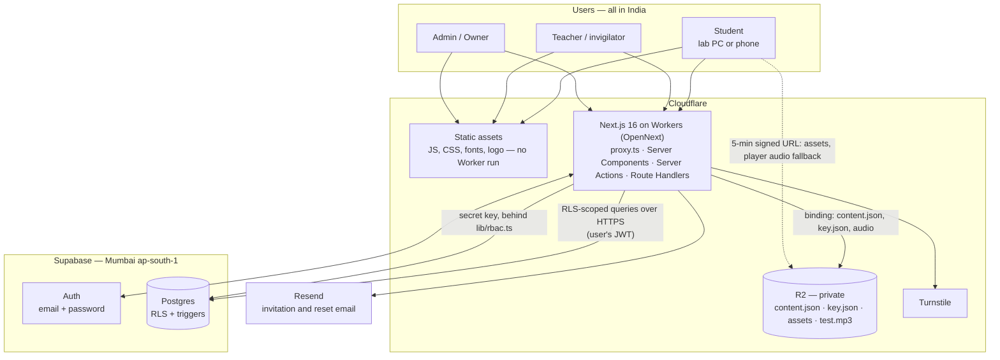
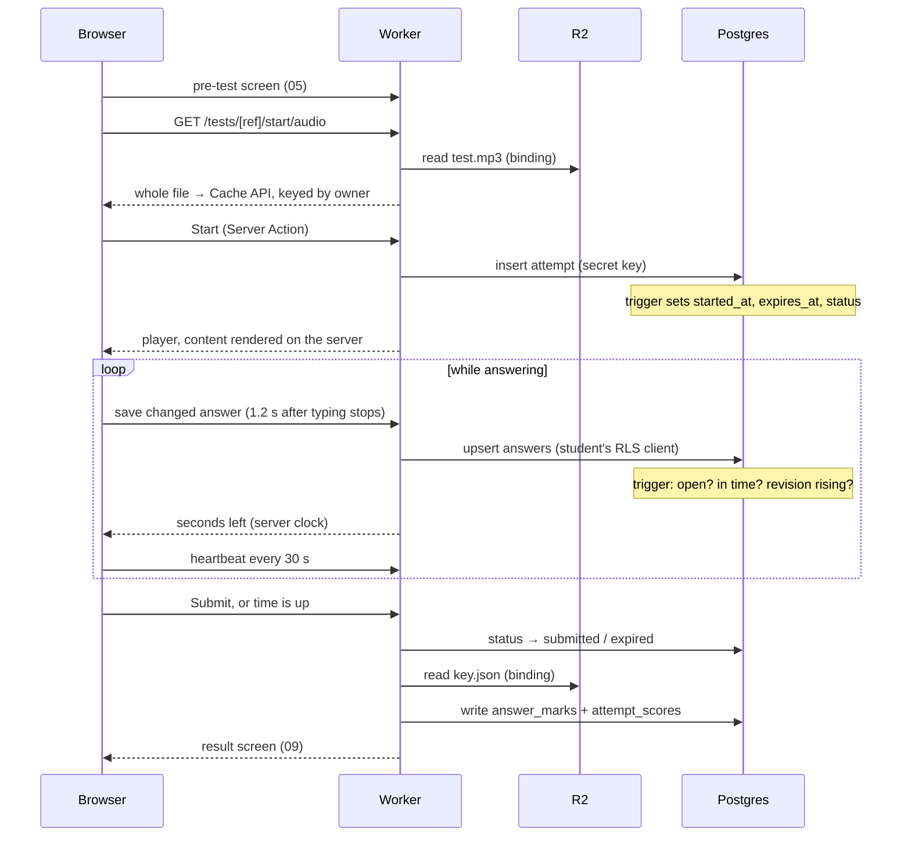

# Architecture

How Insignia IELTS fits together as built (October 2026). The plan is `MVP-1.md` §5; where this page and the plan disagree, this page describes the code and the reason is in `PROJECT-MEMORY.md` §4.

## The pieces

- **The browser never talks to Supabase.** There is no browser Supabase client; `connect-src 'self'`. Every query runs in the Worker, with the user's JWT (so RLS applies) or, for privileged writes, the secret key behind `lib/rbac.ts`.
- **Test content never reaches the browser as a file.** The Worker reads `content.json` through the R2 binding and renders it. `key.json` is read only to mark, inside server code, and is never signable. See [`r2-layout.md`](r2-layout.md).
- **Postgres decides the clock and the state of an attempt**, through triggers. The browser draws a countdown and nothing else ([ADR 0006](adr/0006-server-authority.md)).
- **Not built yet:** the Durable Object rate limiter (sign-in lockout runs on the Postgres `rate_limits` fallback — M1-10), Sentry error reporting, and the authoring MCP (M8).

## Where the code is

| Path | What |
|---|---|
| `src/proxy.ts` | Runs before every page: fresh CSP nonce and security headers; a local JWT check that sends signed-out visitors to `/login`. Queries the database only on `/` and `/login`. |
| `src/app/(auth)` | Sign in, invitation, password reset, first-run `/setup` |
| `src/app/(student)` | Home, My Tests, Progress, Profile, results, review — student layout |
| `src/app/attempt/[attemptId]` | The test player, outside the student layout (no navigation during a test) |
| `src/app/teacher`, `src/app/admin` | Staff areas, each with its own layout and sidebar |
| `src/lib/actions/` | Every Server Action. Each export is a public endpoint; each re-checks permission and session. |
| `src/lib/queries/` | Server-only loaders that build view models (`src/lib/view-models/`) |
| `src/lib/attempts/` | Start, autosave, clock, pause, finish, marking, re-marking |
| `src/lib/auth/` | Sign-in, sessions, guard, invitations, lockout, password reset |
| `src/lib/scoring.ts`, `src/lib/question-types.ts` | Marking and the question-type matrix ([`question-types.md`](question-types.md)) |
| `src/lib/r2.ts`, `src/lib/r2-keys.ts` | R2 reads and signing; server-generated keys |
| `src/lib/security/` | Headers/CSP, passage HTML sanitiser |
| `src/lib/supabase/` | `server.ts` (RLS client), `admin.ts` (secret key), generated types |
| `src/components/player/` | Player and the six answer widgets |
| `supabase/migrations/` | The only schema source ([`data-model.md`](data-model.md)) |

Every `src/lib` folder has a `README.md` stating its one job.

## A page load

1. **Static files** (`/_next/static/*`, fonts, `/brand/*`, favicon) come straight from Cloudflare's asset store — no Worker run, no request against the daily cap.
2. **`proxy.ts`** adds a fresh nonce and the CSP. If the route is protected and there is no valid JWT (verified locally — ES256, no network), it redirects to `/login`.
3. **The area's layout** (student, teacher or admin) runs its guard and **loads every sidebar page's data in the same parallel round** ([ADR 0016](adr/0016-layout-bundles.md)):
   - the guard (`src/lib/auth/guard.ts`) reads the person's profile and checks that the `user_sessions` row named by the `insignia_session` cookie is still live;
   - the loaders read through the user's RLS client;
   - staff pages the person lacks permission for are dropped before anything is sent (`src/lib/bundle-slots.ts`).
4. The pages are client views over that bundle, so **moving between sidebar pages makes no database trip**. Detail pages (one student, one batch, a result set) are server-rendered on open, with their guard and data read side by side (`withGuard`).
5. **`AutoRefresh`** (`src/components/auto-refresh.tsx`) re-renders the layout — new data, and the session re-checked — after a save, every 60 s while someone is active, on return to the tab and on the first touch after idle. An idle or hidden tab makes no requests.

`next.config.ts`: `staleTimes.static` 60 s for prefetched links; `staleTimes.dynamic` stays 0 so the test player is never served from cache.

## An attempt, end to end

- **Audio first.** The whole recording downloads before Start creates the attempt, so a slow network costs waiting time, never test time ([ADR 0008](adr/0008-one-audio-file-per-test.md)). The cache is bound to its owner and purged for anyone else ([ADR 0010](adr/0010-owner-bound-audio-cache.md)).
- **Autosave** is a Server Action per changed answer, retried every 5 s while offline. `localStorage` is crash recovery only; the server marks what the server stored.
- **Heartbeat** every 30 s while the test is visible: re-syncs the clock, checks the session, closes the attempt if the deadline passed, and records practice check-ins.
- **Leaving a test:** mock and class keep running; practice pauses (a gap over 45 s moves the deadline later by the time away, minus one interval).
- **Marking** (`src/lib/attempts/mark.ts`) runs when the attempt closes. If it fails, the attempt stays closed and the result screen repairs it (`markMyResultAction`). Marking is idempotent.
- **Results** appear when the assignment's release gate opens (immediate, scheduled or manual — evaluated by Postgres). The student layout's next refresh picks them up.

## Live monitor

The invigilator's screen (17) polls one aggregated route (`/teacher/live/[sessionId]/state`) every **10 s**. There is no Supabase Realtime anywhere in the product — it would spend free-plan quota for two or three staff viewers.

## Budget: free plans, 200 students at once

The design target is 200 students in one timed test at the same moment, on **Supabase Free** and **Cloudflare Workers Free** (`MVP-1.md` §4). The limits that matter:

| Limit | Consequence | What the design does |
|---|---|---|
| Workers: **100,000 requests/day**, resets 05:30 IST | Over the cap, every page shows error 1027 until 05:30 | Static files don't count; autosave on change, not on a timer |
| Workers: 10 ms CPU, **50 subrequests** per request | Per-row loops of database calls fail past a few students | Bulk queries; marking and re-marking in bulk |
| Supabase Auth: per-IP limit on sign-in | A lab behind one IP signing in together gets "too many requests" | Raise the sign-in limit; JWT longer than a test so nothing refreshes mid-test; `getClaims()` locally. ⚠️ **Not confirmed on the live project** (M1-01, Q16 — awaiting the dashboard change): JWT expiry 3,600 → 7,200 s and the raised sign-in limit. The 7,200 s in `supabase/config.toml` affects only a local stack |
| Supabase: 500 MB, no backups, pauses after ~7 quiet days | Data growth; data loss on a failure; Monday-morning outage | Lean `answers`; nightly dump (M9-06, not built); see [`runbook.md`](runbook.md) |
| PostgREST: 1,000 rows per query, silently | Lists cut short with no error | `selectAll` paging |

⚠️ **The heartbeat is 30 s in code** (`src/components/player/attempt-runner.tsx`), while `MVP-1.md`'s budget of ~120 Worker requests per student per test assumed 60 s. A 60-minute test at 30 s is ~120 heartbeats alone, before saves. The 200-student load test (M9-05, deferred) is where this gets measured; lengthening the heartbeat is the first lever if the daily cap is at risk. The 60 s `AutoRefresh` does not run inside the player.

## Related

- [`data-model.md`](data-model.md) — every table, trigger and function
- [`security.md`](security.md) — threat model and controls
- [`r2-layout.md`](r2-layout.md) — storage keys and signing rules
- [`runbook.md`](runbook.md) — running it
- [`adr/`](adr/README.md) — why it is built this way
