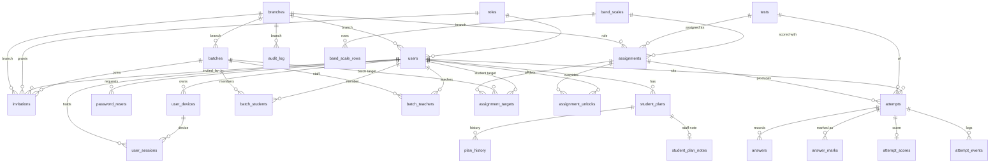

# Data model

What lives in Supabase Postgres (`ap-south-1`, Mumbai), table by table. Test **content** — passages, questions, answer keys, audio, images — is not here; it lives in R2 ([`r2-layout.md`](r2-layout.md), ADR [0004](adr/0004-postgres-people-r2-content.md)).

**Sources of truth, in order:** `supabase/migrations/` (the only schema source — ADR [0014](adr/0014-no-orm.md)), then `src/lib/supabase/database.types.ts` (generated from the live project with `npm run db:types`). This page was written from both on 2026-10-11. When a migration changes a table, update the table's section here in the same PR.

## Diagram

Only real foreign keys are drawn. `audit_log.actor_id` and `plan_history.actor_id` deliberately have none (the trail must survive a person's erasure), and `rate_limits` stands alone.

## Rules every table follows

- **RLS on, default-deny.** A table with no matching policy returns nothing. Policies ship in the same migration as their table.
- **Grants are a gate too.** Each migration revokes Supabase's default grants and grants back only what is needed: `anon` gets nothing; `authenticated` gets `SELECT` on named columns. Secret columns (`token_hash`, `pin_hash`, `device_secret_hash`, `tests.r2_*`) are never granted — which means **`select *` on those tables fails**; always name columns.
- **Identity tables are read-only through the API.** Every write is server code using the secret key, behind `lib/rbac.ts`, audit-logged. The one place students write directly is their own `answers`, through RLS.
- **Policies call helpers, not subqueries.** Cross-table checks use `SECURITY DEFINER` functions in the unexposed `private` schema (`private.is_teacher_of`, `private.results_visible`, …) so policies don't recurse. One `SELECT` policy per table.
- **Times are `timestamptz` in UTC**, shown in `Asia/Kolkata`. Ids are UUIDs.

Who can read which rows: see [`security.md`](security.md#who-can-read-what).

## Identity and access

**`branches`** — `id`, `name`, `address`, `created_at`. A centre. The first one is created by `/setup`.

**`roles`** — `id`, `key` (`super_admin` | `admin` | `teacher` | `invigilator` | `student`), `name`, `permissions` (jsonb: permission → scope `own` | `batch` | `branch` | `all`, `CHECK`-validated), `created_at`. `super_admin` is shown as **Owner**. Permissions are data; the vocabulary and the logic are `src/lib/permissions.ts`.

**`users`** — `id` (= `auth.users.id`), `email` (unique — the identifier), `name`, `phone`, `country_code`, `role_id`, `branch_id`, `status` (`active` | `inactive` | `suspended`), `dob`, `guardian_consent`, `guardian_name`, `guardian_phone`, `created_by`, `created_at`, `updated_at`. No password here — Supabase Auth owns it.

**`invitations`** — `id`, `email`, `name`, `phone`, `country_code`, `role_id`, `branch_id`, `batch_id`, `plan_template`, `token_hash` (never the raw token; not granted), `expires_at` (7 days), `invited_by`, `accepted_at`, `status` (`pending` | `accepted` | `revoked` | `expired`), `created_at`. Revoke is `UPDATE … WHERE status = 'pending'` — it can never touch an accepted invitation.

**`password_resets`** — `id`, `user_id`, `token_hash`, `expires_at` (1 hour), `used_at`, `requested_ip`, `created_at`. No API access; read through `find_password_reset` / `complete_password_reset`.

**`user_sessions`** — `id`, `user_id`, `device_id`, `issued_at`, `last_seen_at`, `revoked_at`, `ip`, `user_agent`. The `insignia_session` cookie names a row; the guard checks it on every guarded page. A student signing in revokes their other sessions; staff may hold several.

**`user_devices`** — `id`, `user_id`, `label`, `user_agent`, `last_used_at`, `revoked_at`, `created_at`, plus `device_secret_hash`, `pin_hash`, `failed_pin_attempts`, `locked_until`. **The PIN columns are unused** — the PIN was dropped (ADR [0009](adr/0009-invite-only-accounts.md)); removing them is M1-14.

## Plans

**`student_plans`** — `id`, `student_id`, `plan_name`, `starts_on`, `expires_on`, `test_quota` (nullable — time-only for now), `tests_used`, `status` (`active` | `expired` | `suspended`), `created_by`, `created_at`. At most one `active` plan per student (partial unique index). Every column is readable by the student it belongs to.

**`student_plan_notes`** — `plan_id` (PK), `body`, `updated_by`, `created_at`, `updated_at`. The staff note about a plan, split out so RLS keeps it from the student (and from teachers).

**`plan_history`** — `id`, `plan_id`, `action` (`create` | `extend` | `suspend` | `resume`), `old_expiry`, `new_expiry`, `reason`, `actor_id` (no FK), `at`. **Append-only** (an `UPDATE` trigger refuses); rows go only with their plan.

## Cohorts

**`batches`** — `id`, `name`, `branch_id`, `starts_on`, `ends_on`, `status`, `created_at`.

**`batch_teachers`** — `batch_id`, `teacher_id`, `created_at`.

**`batch_students`** — `batch_id`, `student_id`, `joined_at`, `left_at`. A teacher sees a student only while `left_at` is null in one of their batches. Students see their own membership rows, never classmates.

## Content catalogue

**`tests`** — `id`, `title`, `skill` (`listening` | `reading` | `writing` | `speaking`), `variant` (`academic` | `general` | `n_a`), `difficulty` (`easy` | `medium` | `hard`), `kind` (`mock` | `class` | `practice` — three pools that never overlap), `practice_question_type` (practice only), `status` (`draft` | `published` | `archived`), `duration_seconds`, `transfer_seconds`, `total_questions`, `section_count`, `content_version`, `audio_duration_seconds`, `tags`, `created_by`, `published_at`, `created_at`, `updated_at`, and the hidden `r2_content_key`, `r2_key_key`, `r2_transcript_key`, `r2_audio_key`, `r2_assets_prefix`.
There is **no `questions` table** (ADR [0004](adr/0004-postgres-people-r2-content.md)). The `r2_*` columns are not granted to `authenticated`: selecting one from a request-scoped client fails the whole query. Server code rebuilds keys from `id` + `content_version` (`src/lib/r2-keys.ts`). The library is shared across branches.

**`band_scales`** — `id`, `skill`, `variant` (Academic and GT Reading use different ladders), `name`, `is_default` (one per skill + variant), `created_by`, `created_at`.

**`band_scale_rows`** — `scale_id`, `raw_min`, `raw_max`, `band` (half-bands; `NULL` = "Below" the scale's lowest band, at most one such row). Ranges may not overlap (`btree_gist` exclusion constraint). Seeded with the institute's charts, each out of 40.

## Assignment

**`assignments`** — `id`, `test_id`, `branch_id`, `available_from`, `due_by`, `max_attempts`, `allow_review`, `results_release` (`immediate` | `scheduled` | `manual`), `results_released_at`, `released_by`, `band_scale_id`, `created_by`, `created_at`.
The release gate, evaluated by Postgres on its own clock: `results_release = 'immediate' OR (results_released_at IS NOT NULL AND results_released_at <= now())`. Scheduled release needs no cron job.

**`assignment_targets`** — `id`, `assignment_id`, `batch_id` | `student_id` (exactly one set, both real FKs).

**`assignment_unlocks`** — `id`, `assignment_id`, `student_id`, `unlocked_by`, `until`, `extra_attempts`, `reason`, `at`. Per-student "unlock now" for latecomers and retakes.

## Assessment

**`attempts`** — `id`, `assignment_id` (null only for self-started practice), `test_id`, `student_id`, `kind`, `content_version`, `status` (`in_progress` | `submitted` | `expired` | `voided`), `started_at`, `expires_at`, `submitted_at`, `time_remaining_seconds` (practice pause), `last_autosave_at`, `audio_downloaded_at`, `audio_started_at`, `audio_completed_at`, `tab_switches`, `device_info`, `created_at`. One open attempt per student per test (partial unique index).

**`answers`** — PK (`attempt_id`, `q_number`), `section_no`, `given_answer` (≤ 500 chars), `flagged`, `revision`, `answered_at`, `updated_at`. Only what the student entered; students write their own rows through RLS.

**`answer_marks`** — PK (`attempt_id`, `q_number`), `section_no`, `question_type` (denormalised at marking — analytics groups by it), `is_correct`, `marks_awarded`, `overridden_by`, `override_note`, `overridden_at`, `scored_at`. One row per question, answered or not. A student sees these only once the attempt is finished, released **and** review is allowed (practice: at once).

**`attempt_scores`** — `attempt_id` (PK), `raw_score`, `band` or `below_band` (exactly one), `section_scores`, `scored_at`. Visible to the student once finished and released.

Correctness and scores are in their own tables because RLS hides rows, not columns: the student must read their `answers` mid-test, so `is_correct` cannot sit on those rows.

**`attempt_events`** — `id`, `attempt_id`, `type`, `meta`, `at`. Append-only integrity log (start, resume, tab blur, extra time, force submit…). Staff-only.

## Cross-cutting

**`audit_log`** — `id`, `actor_id` (no FK), `branch_id`, `action` (`entity.verb`, e.g. `plan.extend`), `entity`, `entity_id`, `meta`, `at`. Append-only; written only by server code (`src/lib/audit.ts`).

**`rate_limits`** — PK (`key`, `window_start`), `count`. Sign-in lockout counters (keys contain IPs). RLS on, **no policy, no grants** — server code only.

## What the database enforces by itself

These hold for every caller, the secret key included — a bug in app code cannot break them.

| Trigger | Table | Enforces |
|---|---|---|
| `attempts_before_insert` | `attempts` | Sets `kind`, `content_version`, `status`, `started_at` and `expires_at` from the test, ignoring the caller. Refuses an assignment for another test, or one that doesn't target the student. |
| `attempts_before_update` | `attempts` | The state machine (`in_progress → submitted | expired | voided`; finished → `voided`); `expires_at` only grows, only while open; identity columns never change; stamps `submitted_at`. |
| `answers_before_write` | `answers` | Writes only while the attempt is `in_progress` and `now() <= expires_at`; `q_number` within the test; `revision` must rise (a replayed or out-of-order save is refused). |
| `*_append_only` | `audit_log`, `plan_history`, `attempt_events` | No `UPDATE`, ever. |
| `*_set_updated_at` | `users`, `tests`, `student_plan_notes` | `updated_at`. |

## Functions called with `.rpc()`

All `SECURITY DEFINER` with a written reason in their migration, and `EXECUTE` revoked from `public` / `anon`.

| Function | Used for |
|---|---|
| `first_run_pending`, `complete_first_run_setup` | The one-time `/setup` for the pinned bootstrap Owner; refuses once any user exists |
| `accept_invitation`, `expire_stale_invitations` | Accepting an invitation atomically; housekeeping for the admin list |
| `find_password_reset`, `complete_password_reset`, `purge_old_password_resets` | Self-serve password reset |
| `bump_rate_limit`, `peek_rate_limit`, `clear_rate_limit`, `purge_old_rate_limits` | Sign-in lockout (5 per account, 30 per IP, 15-minute window) |

Starting, closing and marking an attempt are not functions: they are server code with the secret key (`src/lib/actions/attempts.ts`, `src/lib/attempts/finish.ts`, `src/lib/attempts/mark.ts`), relying on the triggers above.

## Things that have bitten

- **PostgREST returns at most 1,000 rows, with no error.** Anything that grows with students × questions must page with `selectAll` (`src/lib/queries/shared.ts`) and a stable `order`. Still unpaged (check before 200 students): live-monitor answers, progress accuracy marks, class analytics marks.
- **Append-only tables can't have `ON DELETE SET NULL` foreign keys** — the FK action is an `UPDATE` the trigger refuses, so the parent's delete fails. That is why actor ids have no FK.
- **Postgres truncates identifiers at 63 characters** (a notice, not an error). Keep policy names short.
- **Size budget:** Supabase Free is 500 MB. `answers` grows ~40 rows per attempt; archive old per-question detail to R2 before 400 MB.
- **Regenerate types after every migration:** `npm run db:types` (needs the user's Supabase CLI login).
